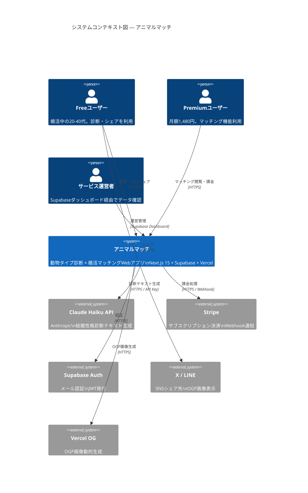
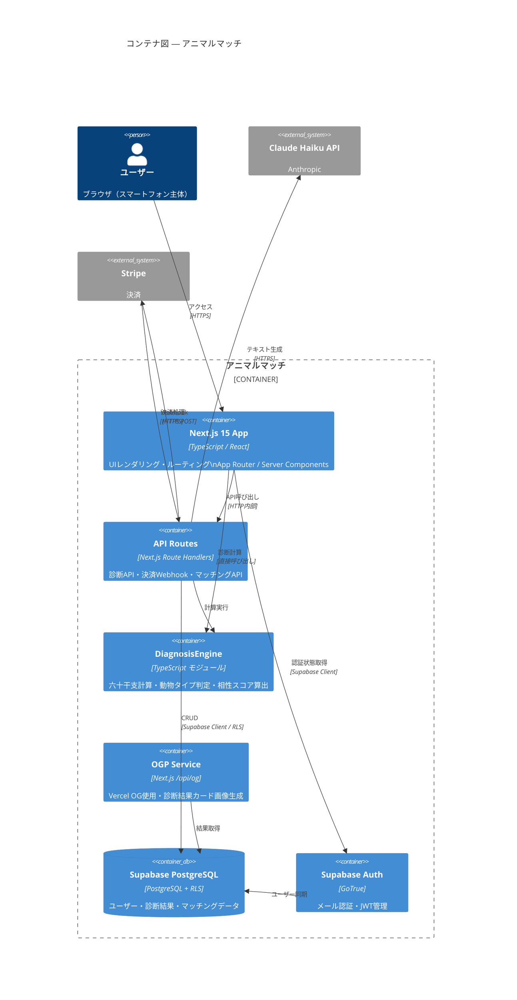
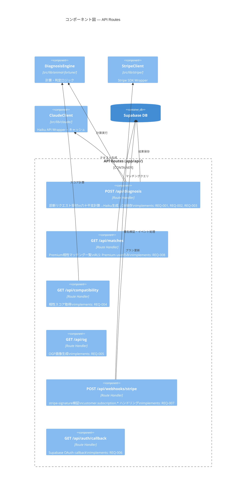
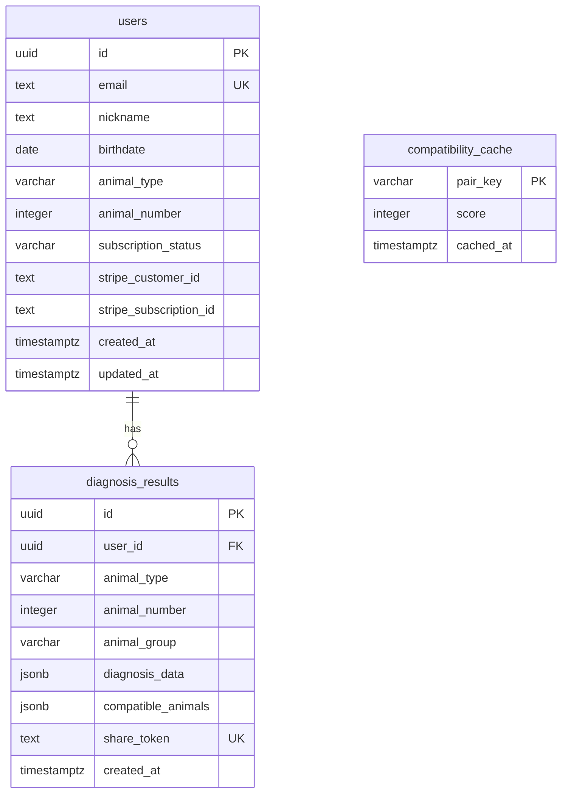
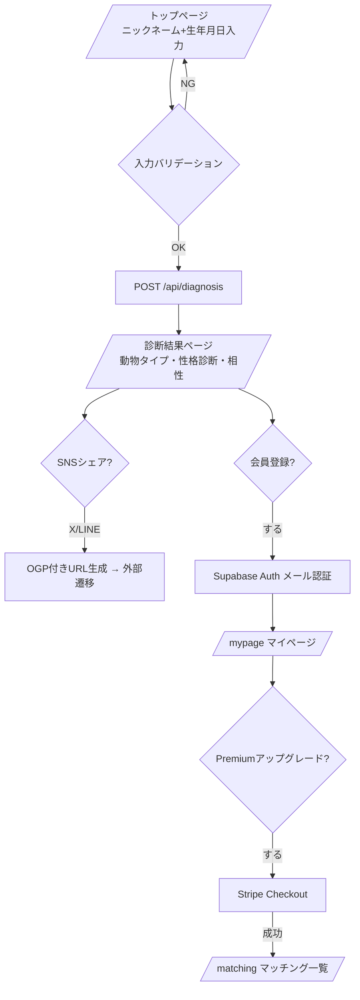

# Design: animal-match

> C4モデル準拠設計書 / sdd-full パイプライン生成
> 生成日: 2026-03-19 | spec-slug: animal-match
> 入力: requirements.md (REQ-001〜REQ-008, REQ-901〜REQ-903, REQ-SEC-001〜REQ-SEC-004)

---

## 1. アーキテクチャ概要

### 設計原則

| 原則 | 採用理由 |
|------|---------|
| フリーミアムモデル | Free診断で獲得 → Premium課金でマネタイズ |
| サーバーレス優先 | Vercel + Supabase でインフラ管理コストゼロ |
| AIコスト最小化 | Haiku API（最廉価）+ キャッシュで診断コストを抑制 |
| データ最小化 | 生年月日・ニックネームのみ収集（個人情報保護法準拠） |
| RLS by design | Supabase Row Level Security を全テーブルに適用 |

---

## 2. C4モデル Level 1: システムコンテキスト図



---

## 3. C4モデル Level 2: コンテナ図



---

## 4. C4モデル Level 3: コンポーネント図（API Routes）



---

## 5. APIエンドポイント設計

### 5.1 エンドポイント一覧

| Method | Path | 認証 | プラン | 説明 | REQ |
|--------|------|------|--------|------|-----|
| POST | `/api/diagnosis` | 不要 | Free | 診断実行 | REQ-001,002,003 |
| GET | `/api/diagnosis/:id` | 不要 | Free | 診断結果取得 | REQ-003 |
| GET | `/api/compatibility` | 不要 | Free | 動物間相性スコア | REQ-004 |
| GET | `/api/og` | 不要 | Free | OGP画像生成 | REQ-005 |
| POST | `/api/auth/signup` | 不要 | - | メール登録 | REQ-006 |
| GET | `/api/auth/callback` | 不要 | - | OAuth callback | REQ-006 |
| POST | `/api/checkout` | JWT | Free | Stripe Checkout生成 | REQ-007 |
| POST | `/api/webhooks/stripe` | Stripe-Sig | - | Webhook受信 | REQ-007 |
| GET | `/api/matches` | JWT | Premium | 相性マッチング一覧 | REQ-008 |

### 5.2 POST /api/diagnosis — リクエスト/レスポンス

```yaml
# Request
POST /api/diagnosis
Content-Type: application/json

{
  "nickname": "string, 1-20文字, 必須",
  "birthdate": "string, YYYY-MM-DD形式, 1900-01-01〜2010-12-31, 必須"
}

# Response 200
{
  "id": "uuid",
  "animalType": "lion | cheetah | black-panther | wolf | koala | monkey | black-cat | tanuki | pegasus | elephant | sheep | tiger",
  "animalNumber": "integer, 1-60",
  "group": "SUN | EARTH | MOON",
  "diagnosis": {
    "catchphrase": "string",
    "marriagePersonality": ["string"],
    "strengths": ["string"],
    "weaknesses": ["string"],
    "idealPartner": "string",
    "marriageAdvice": "string"
  },
  "compatibleAnimals": [
    { "animalType": "string", "score": "integer 0-100" }
  ],
  "shareUrl": "string, HTTPS URL"
}

# Response 400
{ "error": "INVALID_INPUT", "message": "string" }

# Response 429
{ "error": "RATE_LIMIT", "retryAfter": "integer seconds" }

# Response 503
{ "error": "AI_UNAVAILABLE", "message": "string" }
```

### 5.3 GET /api/matches — リクエスト/レスポンス

```yaml
# Request
GET /api/matches?limit=20&offset=0
Authorization: Bearer <JWT>

# Response 200 (Premium only)
{
  "matches": [
    {
      "userId": "uuid",
      "nickname": "string",
      "animalType": "string",
      "compatibilityScore": "integer 0-100",
      "compatibilityLabel": "最高 | 良好 | 普通 | 要注意"
    }
  ],
  "total": "integer",
  "limit": 20,
  "offset": 0
}

# Response 403
{ "error": "PREMIUM_REQUIRED", "upgradeUrl": "string" }
```

---

## 6. データモデル設計

### 6.1 ER図



### 6.2 主要テーブル定義

#### users

| カラム | 型 | 制約 | 説明 |
|--------|-----|------|------|
| id | uuid | PK, default gen_random_uuid() | ユーザーID |
| email | text | UNIQUE, NOT NULL | メールアドレス |
| nickname | text | NOT NULL, len <= 20 | 表示名 |
| birthdate | date | NOT NULL | 生年月日 |
| animal_type | varchar(20) | | 動物タイプ |
| animal_number | integer | CHECK(1-60) | 動物番号 |
| subscription_status | varchar(20) | DEFAULT 'free' | free / premium / cancelled |
| stripe_customer_id | text | | Stripe顧客ID |
| stripe_subscription_id | text | | StripeサブスクリプションID |
| created_at | timestamptz | DEFAULT now() | 登録日時 |
| updated_at | timestamptz | DEFAULT now() | 更新日時 |

#### diagnosis_results

| カラム | 型 | 制約 | 説明 |
|--------|-----|------|------|
| id | uuid | PK | 診断ID |
| user_id | uuid | FK(users.id), nullable | ログイン済みの場合のみ |
| animal_type | varchar(20) | NOT NULL | 動物タイプ |
| animal_number | integer | NOT NULL | 1-60 |
| animal_group | varchar(10) | NOT NULL | SUN/EARTH/MOON |
| diagnosis_data | jsonb | NOT NULL | AIが生成した診断テキスト |
| compatible_animals | jsonb | NOT NULL | 相性動物リスト+スコア |
| share_token | text | UNIQUE | SNSシェア用トークン |
| created_at | timestamptz | DEFAULT now() | 診断日時 |

### 6.3 RLSポリシー定義

```sql
-- users: 自分のレコードのみ参照・更新可
CREATE POLICY "users_self_select" ON users
    FOR SELECT USING (auth.uid() = id);

CREATE POLICY "users_self_update" ON users
    FOR UPDATE USING (auth.uid() = id);

-- diagnosis_results: 本人 or share_token 公開参照
CREATE POLICY "diagnosis_self" ON diagnosis_results
    FOR SELECT USING (
        user_id = auth.uid()
        OR share_token IS NOT NULL
    );

-- matches: Premium ユーザーのみ他ユーザーの動物タイプを参照可
CREATE POLICY "matches_premium_only" ON users
    FOR SELECT USING (
        auth.uid() IN (
            SELECT id FROM users WHERE subscription_status = 'premium'
        )
    );
```

---

## 7. DiagnosisEngine 設計

### 7.1 六十干支計算アルゴリズム（REQ-002準拠）

```typescript
// src/lib/animal-fortune/engine.ts

/**
 * 六十干支番号を計算する
 * 計算式: ((Excelシリアル日数 + 8) % 60) + 1
 * Excelシリアル日数 = 1900-01-01を1とする経過日数
 * @implements REQ-002
 */
export function calcAnimalNumber(birthdate: Date): number {
  const excelEpoch = new Date(1900, 0, 1);
  const diffDays = Math.floor(
    (birthdate.getTime() - excelEpoch.getTime()) / 86_400_000
  ) + 1; // Excel起算補正
  return ((diffDays + 8) % 60) + 1;
}

/**
 * 動物番号(1-60) → 動物タイプ(12種)へのマッピング
 * 各5番号が1タイプに対応
 * @implements REQ-002
 */
export function mapToAnimalType(animalNumber: number): AnimalId {
  const MAPPING: Record<number, AnimalId> = {
    1: 'lion', 2: 'cheetah', 3: 'black-panther', 4: 'wolf', 5: 'koala',
    6: 'monkey', 7: 'black-cat', 8: 'tanuki', 9: 'pegasus', 10: 'elephant',
    11: 'sheep', 12: 'tiger',
  };
  const groupIndex = Math.ceil(animalNumber / 5);
  return MAPPING[groupIndex] ?? 'lion';
}

/**
 * 相性スコアを計算する（円環距離ベース）
 * @implements REQ-004
 */
export function calcCompatibilityScore(
  animalNumberA: number,
  animalNumberB: number
): number {
  const distance = Math.abs(animalNumberA - animalNumberB);
  const circularDistance = Math.min(distance, 60 - distance);
  return Math.round(100 - (circularDistance / 30) * 100);
}
```

### 7.2 Claude Haiku API ラッパー（REQ-003準拠）

```typescript
// src/lib/claude/client.ts

const DIAGNOSIS_PROMPT_TEMPLATE = `
あなたは結婚カウンセラーです。
動物タイプ「{animalName}」の人の結婚における性格を以下のJSON形式で生成してください。
禁止: 「動物占い」「個性心理学」「動物キャラナビ」の語は使用しない。

{
  "catchphrase": "20文字以内の一言キャッチ",
  "marriagePersonality": ["性格特徴1", "性格特徴2", "性格特徴3"],
  "strengths": ["長所1", "長所2"],
  "weaknesses": ["注意点1", "注意点2"],
  "idealPartner": "100文字以内のパートナー像",
  "marriageAdvice": "150文字以内のアドバイス"
}
`;

// キャッシュ: 動物タイプは12種固定 → メモリキャッシュで十分
const diagnosisCache = new Map<string, DiagnosisData>();

export async function generateDiagnosis(animalId: AnimalId): Promise<DiagnosisData> {
  if (diagnosisCache.has(animalId)) {
    return diagnosisCache.get(animalId)!;
  }

  // Haiku API呼び出し
  const result = await callClaudeHaiku(animalId);
  diagnosisCache.set(animalId, result);
  return result;
}
```

---

## 8. フロントエンド設計

### 8.1 ページ構成（App Router）

| ページ | パス | 認証 | 説明 |
|--------|------|------|------|
| トップ/入力 | `/` | 不要 | ニックネーム・生年月日入力フォーム |
| 診断結果 | `/result/[id]` | 不要 | 結果表示・SNSシェアボタン |
| ログイン | `/login` | 不要 | Supabase Auth メール認証 |
| マイページ | `/mypage` | JWT | 過去診断履歴・プラン状況 |
| マッチング | `/matching` | JWT+Premium | 相性マッチング一覧 |
| 課金 | `/upgrade` | JWT | Stripe Checkout遷移 |
| 利用規約 | `/terms` | 不要 | |
| プライバシー | `/privacy` | 不要 | |

### 8.2 ユーザーフロー



### 8.3 コンポーネント設計

```
src/
├── app/
│   ├── page.tsx                    # トップ（入力フォーム）
│   ├── result/[id]/page.tsx        # 診断結果
│   ├── matching/page.tsx           # マッチング（Premium）
│   ├── mypage/page.tsx             # マイページ
│   ├── upgrade/page.tsx            # 課金ページ
│   └── api/
│       ├── diagnosis/route.ts      # REQ-001,002,003
│       ├── compatibility/route.ts  # REQ-004
│       ├── og/route.ts             # REQ-005 (OGP)
│       ├── checkout/route.ts       # REQ-007
│       ├── matches/route.ts        # REQ-008
│       └── webhooks/stripe/route.ts
├── components/
│   ├── DiagnosisForm.tsx           # 入力フォーム（Zod validation）
│   ├── AnimalCard.tsx              # 動物タイプカード
│   ├── DiagnosisResult.tsx         # 結果表示
│   ├── CompatibilityList.tsx       # 相性一覧
│   ├── ShareButtons.tsx            # SNSシェアボタン
│   └── PremiumGate.tsx             # Premium誘導
└── lib/
    ├── animal-fortune/
    │   ├── engine.ts               # 計算ロジック
    │   ├── data.ts                 # 12動物データ
    │   └── types.ts                # 型定義
    ├── claude/
    │   └── client.ts               # Haiku APIラッパー
    └── stripe/
        └── client.ts               # Stripe SDKラッパー
```

---

## 9. セキュリティ設計（REQ-SEC準拠）

### 9.1 認証・認可アーキテクチャ（REQ-SEC-001）

```
[ブラウザ] → Supabase Auth → JWT(RS256)
         ↓
[Next.js API Routes]
  - createServerClient(cookies()) でJWT検証
  - auth.uid() をRLSで自動適用
  - Premium判定: users.subscription_status = 'premium'
```

### 9.2 Stripe Webhook セキュリティ（REQ-SEC-002）

```typescript
// POST /api/webhooks/stripe
const sig = req.headers['stripe-signature'];
const event = stripe.webhooks.constructEvent(
  rawBody,        // raw Buffer
  sig,
  process.env.STRIPE_WEBHOOK_SECRET
); // 署名検証失敗時は WebhookSignatureVerificationError → 400
```

### 9.3 入力サニタイズ（REQ-SEC-003）

```typescript
// DiagnosisForm バリデーション（Zod）
const diagnosisSchema = z.object({
  nickname: z.string().min(1).max(20).regex(/^[^\u0000-\u001F<>&"'/\\]+$/),
  birthdate: z.string().regex(/^\d{4}-\d{2}-\d{2}$/).refine(
    (d) => {
      const date = new Date(d);
      return date >= new Date('1900-01-01') && date <= new Date('2010-12-31');
    },
    { message: '1900年〜2010年の範囲で入力してください' }
  ),
});
```

### 9.4 レート制限（REQ-SEC-004）

```typescript
// /api/diagnosis: 同一IPから1分間に5リクエストまで
// 実装: Vercel Edge Middleware + KV Store (Upstash Redis)
const ratelimit = new Ratelimit({
  redis: Redis.fromEnv(),
  limiter: Ratelimit.slidingWindow(5, '1 m'),
});
```

### 9.5 秘匿情報管理

| 変数名 | 用途 | 格納場所 |
|--------|------|---------|
| `ANTHROPIC_API_KEY` | Claude Haiku API | Vercel環境変数（暗号化） |
| `STRIPE_SECRET_KEY` | Stripe API | Vercel環境変数 |
| `STRIPE_WEBHOOK_SECRET` | Webhook署名検証 | Vercel環境変数 |
| `NEXT_PUBLIC_SUPABASE_URL` | Supabase URL | Vercel環境変数（公開可） |
| `SUPABASE_SERVICE_ROLE_KEY` | Supabase管理操作 | Vercel環境変数（非公開） |

---

## 10. 非機能設計（REQ-901〜903準拠）

### 10.1 パフォーマンス設計（REQ-901）

| 対策 | 内容 |
|------|------|
| Haiku診断キャッシュ | 動物タイプ12種固定 → プロセス内メモリキャッシュ（TTL: アプリ起動中） |
| Next.js ISR | 診断結果ページを60秒ISRでキャッシュ |
| Edge Runtime | `/api/og` をVercel Edge Runtimeで実行（レイテンシ最小化） |
| Supabase接続プール | PgBouncer経由でDB接続数を制限 |

### 10.2 可用性設計（REQ-902）

| 対策 | 内容 |
|------|------|
| Vercel自動スケーリング | サーバーレス関数でスパイク対応 |
| Haiku API障害時 | フォールバック: 動物タイプ固有の静的テキストを返す（REQ-003 例外処理） |
| Stripe Webhook再試行 | Stripe側が最大72時間・最大8回再試行（冪等性キーで重複処理防止） |

### 10.3 データ保護設計（REQ-903）

| 対策 | 内容 |
|------|------|
| 転送時暗号化 | Vercel/Supabase は全通信TLS 1.3 |
| 保存時暗号化 | Supabase PostgreSQL: AES-256 at rest |
| 生年月日の扱い | ユーザー確認後に動物番号として変換。生の生年月日はDB保存最小化を検討 |
| データ削除 | 退会時に users レコードをCASCADE削除（diagnosis_resultsも連鎖削除） |

---

## 11. ADR（Architecture Decision Records）サマリー

| ID | タイトル | 決定 | 理由 |
|----|---------|------|------|
| ADR-001 | AIモデル選択 | Claude Haiku | コスト最安（診断12種をキャッシュすれば月$1以下） |
| ADR-002 | 認証基盤 | Supabase Auth | メール認証で十分、GoTrue標準実装で工数削減 |
| ADR-003 | 決済 | Stripe | 日本市場対応、Webhook信頼性が高い |
| ADR-004 | OGP画像生成 | Vercel OG (@vercel/og) | Edge RuntimeでSNSクローラーのレイテンシ対応 |
| ADR-005 | レート制限 | Upstash Redis + Vercel Edge Middleware | サーバーレス環境でのIPベース制限に最適 |
| ADR-006 | 商標対策 | 独自名称「アニマルマッチ」「アニマルタイプ診断」 | 「動物占い®」「個性心理学®」使用禁止 |

---

## 12. REQ↔設計 トレーサビリティ

| REQ ID | 実装場所 |
|--------|---------|
| REQ-001 | `components/DiagnosisForm.tsx`, `app/api/diagnosis/route.ts` |
| REQ-002 | `src/lib/animal-fortune/engine.ts#calcAnimalNumber` |
| REQ-003 | `src/lib/claude/client.ts`, `app/api/diagnosis/route.ts` |
| REQ-004 | `src/lib/animal-fortune/engine.ts#calcCompatibilityScore`, `app/api/compatibility/route.ts` |
| REQ-005 | `app/api/og/route.ts`, `components/ShareButtons.tsx` |
| REQ-006 | `app/api/auth/callback/route.ts`, Supabase Auth設定 |
| REQ-007 | `app/api/checkout/route.ts`, `app/api/webhooks/stripe/route.ts` |
| REQ-008 | `app/api/matches/route.ts`, RLSポリシー `matches_premium_only` |
| REQ-901 | Haiku診断キャッシュ, Next.js ISR設定 |
| REQ-902 | Vercel自動スケーリング, Haiku障害フォールバック |
| REQ-903 | Supabase RLS, TLS設定, CASCADE削除 |
| REQ-SEC-001 | Supabase Auth JWT検証, RLSポリシー |
| REQ-SEC-002 | `webhooks/stripe/route.ts` stripe.webhooks.constructEvent |
| REQ-SEC-003 | `components/DiagnosisForm.tsx` Zodスキーマ |
| REQ-SEC-004 | Vercel Edge Middleware + Upstash Redis |
