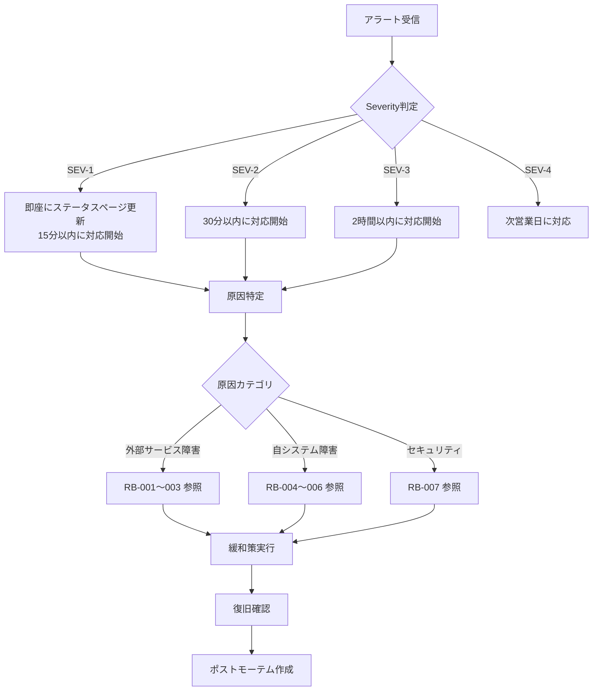

# Runbook: animal-match

> インシデント対応手順 / sdd-full パイプライン生成
> 生成日: 2026-03-19 | spec-slug: animal-match
> 入力: design.md, slo.md

---

## 1. インシデント分類

| Severity | 定義 | 応答目標 | 例 |
|----------|------|---------|-----|
| SEV-1 | サービス全停止 or 個人情報漏洩 | 15分以内に対応開始 | Vercel障害、DB全断、RLS無効化 |
| SEV-2 | 主要機能停止（診断 or 決済不可） | 30分以内 | Haiku API障害、Stripe障害 |
| SEV-3 | 一部機能劣化 | 2時間以内 | OGP画像生成失敗、レイテンシ増大 |
| SEV-4 | 軽微な問題 | 次営業日 | UI表示崩れ、非重要ログエラー |

---

## 2. インシデント対応フロー



---

## 3. Runbook一覧

### RB-001: Claude Haiku API 障害

| 項目 | 内容 |
|------|------|
| Severity | SEV-2 |
| 検知 | SLI-004 AI診断成功率 < 95%（5分間） |
| 影響 | 新規診断でAI生成テキストが取得できない |

**手順**:

1. **確認**: Anthropic Status Page (https://status.anthropic.com) をチェック
2. **フォールバック確認**: 静的テキスト返却が動作しているか確認
   ```bash
   curl -X POST https://{domain}/api/diagnosis \
     -H 'Content-Type: application/json' \
     -d '{"nickname":"test","birthdate":"1990-01-01"}'
   # → diagnosis_data が静的テキストで返ってくればフォールバック動作中
   ```
3. **キャッシュ確認**: 12動物タイプすべてキャッシュ済みならAPI呼び出しは不要
4. **復旧確認**: Anthropic障害復旧後、キャッシュをクリアして新規診断テスト
5. **長期化時**: 静的テキストのままで運用継続（ユーザーへの影響は診断品質の低下のみ）

### RB-002: Stripe 障害

| 項目 | 内容 |
|------|------|
| Severity | SEV-2 |
| 検知 | Stripe Webhook受信が30分以上途絶 / Checkout Session作成失敗 |
| 影響 | 新規課金・プラン変更が不可 |

**手順**:

1. **確認**: Stripe Status Page (https://status.stripe.com) をチェック
2. **影響範囲**: 既存Premiumユーザーは影響なし（ステータスはDBに保存済み）
3. **緩和**: `/upgrade` ページに「現在決済システムがメンテナンス中です」バナー表示
4. **復旧確認**: Stripe復旧後、未処理Webhookが自動再送（最大72時間）されることを確認
5. **手動確認**: Stripe Dashboard → Events で未配信イベントを確認

### RB-003: Supabase 障害

| 項目 | 内容 |
|------|------|
| Severity | SEV-1（DB全断）/ SEV-2（Auth障害のみ） |
| 検知 | SLI-001 可用性 < 99% / 5xx急増 |
| 影響 | DB全断: 全機能停止。Auth障害: ログイン不可（診断は匿名で継続可能） |

**手順**:

1. **確認**: Supabase Status Page (https://status.supabase.com) をチェック
2. **DB全断の場合**:
   - 診断計算はクライアント側で実行可能だが、結果保存不可
   - 「一時的にサービスが利用できません」ページ表示
3. **Auth障害の場合**:
   - 匿名診断は継続可能
   - ログイン・マイページ・マッチングは一時停止
4. **復旧確認**: Supabase復旧後、DB接続プール正常化を確認
5. **データ整合性**: 復旧後にdiagnosis_resultsの重複チェック

### RB-004: レイテンシ劣化

| 項目 | 内容 |
|------|------|
| Severity | SEV-3 |
| 検知 | SLI-002 P95 > 1,000ms（5分間） |
| 影響 | ユーザー体験の劣化 |

**手順**:

1. **原因切り分け**:
   - Vercel Function Duration ログ確認 → API処理時間
   - Supabase Dashboard → DB Query Performance
   - Claude Haiku API応答時間（アプリケーションログ）
2. **Haiku API遅延の場合**: キャッシュヒット率確認。全12タイプキャッシュ済みなら問題なし
3. **DB遅延の場合**: Supabase Dashboard → Slow Queries 確認
4. **Vercel遅延の場合**: Cold Start問題 → Edge Runtime移行を検討
5. **緩和**: 一時的にISRキャッシュTTLを延長（60秒→300秒）

### RB-005: エラー率急増

| 項目 | 内容 |
|------|------|
| Severity | SEV-2 |
| 検知 | SLI-003 > 1%（5分間） |
| 影響 | ユーザーの診断・機能利用に失敗 |

**手順**:

1. **ログ確認**: Vercel Logs → 5xxエラーの内容確認
2. **デプロイ起因か確認**: 直近のデプロイタイムスタンプとエラー開始時刻を比較
3. **デプロイ起因の場合**:
   ```bash
   # Vercel CLIでロールバック
   vercel rollback
   ```
4. **外部サービス起因の場合**: RB-001〜003を参照
5. **原因不明の場合**: Vercel Logs のエラースタックトレースを収集し調査

### RB-006: レート制限誤発動

| 項目 | 内容 |
|------|------|
| Severity | SEV-3 |
| 検知 | 429レスポンス率が異常に高い / ユーザーからの苦情 |
| 影響 | 正規ユーザーが診断できない |

**手順**:

1. **確認**: Upstash Redis Dashboard → レート制限カウンター確認
2. **原因**: 共有IP（企業ネットワーク等）からの複数ユーザーアクセス
3. **緩和**: レート制限の閾値を一時的に緩和（5req/min → 15req/min）
4. **恒久対策**: IPベースからユーザーIDベースのレート制限へ移行を検討

### RB-007: セキュリティインシデント

| 項目 | 内容 |
|------|------|
| Severity | SEV-1 |
| 検知 | RLS貫通の疑い / APIキー漏洩の疑い / 不審な大量アクセス |
| 影響 | 個人情報漏洩リスク |

**手順**:

1. **即座にアクセス遮断**:
   - Vercel: 該当IPをブロック（Vercel Firewall）
   - Supabase: 該当ユーザーセッション無効化
2. **APIキー漏洩の場合**:
   - Anthropic API Key: Anthropic Consoleで即座にローテーション
   - Stripe Key: Stripe Dashboardで即座にローテーション
   - Supabase Service Role Key: Supabase Dashboardでリセット
   - Vercel環境変数を新しいキーで更新 → 再デプロイ
3. **RLS貫通の場合**:
   - Supabase Dashboard → RLSポリシー確認
   - `SUPABASE_SERVICE_ROLE_KEY` がクライアント側に漏洩していないか確認
   - 影響範囲調査: 不正アクセスされたレコードの特定
4. **法的対応**: 個人情報漏洩の場合、個人情報保護委員会への報告を検討（72時間以内）
5. **ポストモーテム**: 必須。原因・影響範囲・再発防止策を記録

---

## 4. 連絡先・エスカレーション

| 役割 | 連絡先 | エスカレーション条件 |
|------|--------|-------------------|
| 運営者（開発者） | Slack #animal-match-alerts | 全アラート |
| Vercel Support | support@vercel.com | SEV-1でVercel起因の場合 |
| Supabase Support | support@supabase.com | SEV-1でSupabase起因の場合 |
| Stripe Support | stripe.com/support | 決済関連SEV-1 |

---

## 5. 定期メンテナンス

| タスク | 頻度 | 手順 |
|--------|------|------|
| 依存パッケージ更新 | 月次 | `npm audit` → `npm update` → E2Eテスト実行 |
| APIキーローテーション | 90日ごと | Anthropic/Stripe/Supabaseキーを順次更新 |
| Supabase DBバックアップ確認 | 週次 | Supabase Dashboard → Backups で自動バックアップ確認 |
| Error Budget レビュー | 月次 | SLO達成状況の確認 → 必要に応じてSLO調整 |
| セキュリティスキャン | 月次 | `npm audit` + 依存脆弱性チェック |
