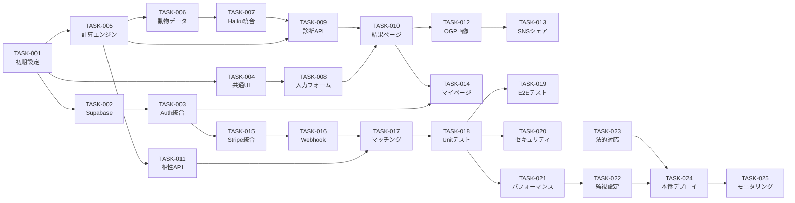
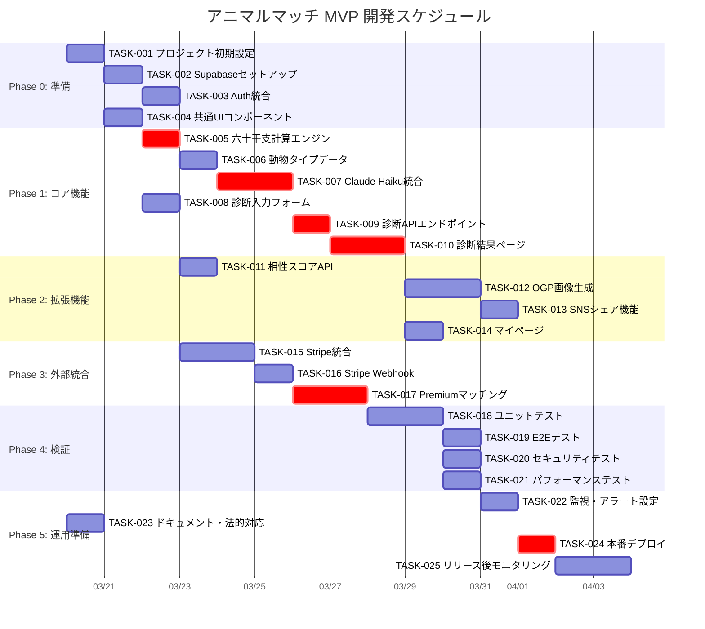

# Tasks: animal-match

> Kiro形式タスク分解 + Ganttチャート / sdd-full パイプライン生成
> 生成日: 2026-03-19 | spec-slug: animal-match
> 入力: requirements.md, design.md

---

## 1. フェーズ概要

| Phase | 名称 | 期間 | 主要成果物 |
|-------|------|------|-----------|
| 0 | 準備 | Day 1-2 | 環境構築・DB・認証設定 |
| 1 | コア機能 | Day 3-10 | 診断エンジン・AI統合・結果表示 |
| 2 | 拡張機能 | Day 11-16 | SNSシェア・OGP・相性スコア |
| 3 | 外部統合 | Day 17-20 | Stripe決済・Premium機能 |
| 4 | 検証 | Day 21-24 | テスト・セキュリティ・パフォーマンス |
| 5 | 運用準備 | Day 25-28 | 監視・ドキュメント・リリース |

---

## 2. タスク一覧

### Phase 0: 準備（Day 1-2）

#### TASK-001: プロジェクト初期設定
- **Implements**: -（基盤）
- **依存**: なし
- **工数**: 0.5日
- **内容**:
  - [ ] Next.js 15 App Router プロジェクト構成確認
  - [ ] TypeScript strict mode 有効化
  - [ ] ESLint / Prettier 設定
  - [ ] `.env.local` テンプレート作成（環境変数一覧）
  - [ ] Vercel プロジェクト作成・Git連携

#### TASK-002: Supabase セットアップ
- **Implements**: REQ-006, REQ-SEC-001
- **依存**: TASK-001
- **工数**: 0.5日
- **内容**:
  - [ ] Supabase プロジェクト作成
  - [ ] users テーブル作成（design.md §6.2 準拠）
  - [ ] diagnosis_results テーブル作成
  - [ ] RLSポリシー設定（design.md §6.3 準拠）
  - [ ] Supabase Auth メール認証有効化
  - [ ] `NEXT_PUBLIC_SUPABASE_URL`, `SUPABASE_SERVICE_ROLE_KEY` を `.env.local` に設定

#### TASK-003: Supabase Auth 統合
- **Implements**: REQ-006
- **依存**: TASK-002
- **工数**: 0.5日
- **内容**:
  - [ ] `@supabase/ssr` インストール・設定
  - [ ] `app/api/auth/callback/route.ts` 実装
  - [ ] Middleware でセッション更新
  - [ ] `/login` ページ作成

#### TASK-004: 共通UIコンポーネント
- **Implements**: -（基盤）
- **依存**: TASK-001
- **工数**: 0.5日
- **内容**:
  - [ ] レイアウト（Header / Footer）
  - [ ] ボタン・フォーム基礎コンポーネント
  - [ ] レスポンシブ設定（モバイルファースト）

### Phase 1: コア機能（Day 3-10）

#### TASK-005: 六十干支計算エンジン
- **Implements**: REQ-002
- **依存**: TASK-001
- **工数**: 1日
- **内容**:
  - [ ] `src/lib/animal-fortune/engine.ts` 作成
  - [ ] `calcAnimalNumber(birthdate: Date): number` 実装
  - [ ] `mapToAnimalType(animalNumber: number): AnimalId` 実装
  - [ ] `calcCompatibilityScore(a: number, b: number): number` 実装
  - [ ] ユニットテスト: 既知の生年月日10件でクロスチェック（ASM-001検証）

#### TASK-006: 動物タイプデータ定義
- **Implements**: REQ-002, REQ-003
- **依存**: TASK-005
- **工数**: 0.5日
- **内容**:
  - [ ] `src/lib/animal-fortune/data.ts` 12動物の基本データ定義
  - [ ] 既存 `types.ts`（AnimalData / DiagnosisInput / DiagnosisResult）との整合確認
  - [ ] 60番号→12動物マッピングテーブル定義

#### TASK-007: Claude Haiku API統合
- **Implements**: REQ-003
- **依存**: TASK-006
- **工数**: 1.5日
- **内容**:
  - [ ] `src/lib/claude/client.ts` 作成
  - [ ] プロンプトテンプレート定義（商標禁止語チェック含む）
  - [ ] レスポンスJSONパース + Zodバリデーション
  - [ ] メモリキャッシュ実装（12種固定→Map）
  - [ ] フォールバック: API障害時に静的テキスト返却
  - [ ] テスト: モック使用のユニットテスト

#### TASK-008: 診断入力フォーム
- **Implements**: REQ-001
- **依存**: TASK-004
- **工数**: 1日
- **内容**:
  - [ ] `components/DiagnosisForm.tsx` 作成
  - [ ] Zodスキーマによるバリデーション（design.md §9.3 準拠）
  - [ ] ニックネーム: 1-20文字、制御文字・HTML特殊文字禁止
  - [ ] 生年月日: YYYY-MM-DD、1900-01-01〜2010-12-31
  - [ ] エラーメッセージ表示
  - [ ] コンポーネントテスト

#### TASK-009: 診断APIエンドポイント
- **Implements**: REQ-001, REQ-002, REQ-003
- **依存**: TASK-005, TASK-007
- **工数**: 1日
- **内容**:
  - [ ] `app/api/diagnosis/route.ts` POST ハンドラ実装
  - [ ] リクエストバリデーション（Zod）
  - [ ] 六十干支計算→動物タイプ判定→Haiku診断→DB保存
  - [ ] レスポンス形式: design.md §5.2 準拠
  - [ ] エラーハンドリング: 400, 429, 503
  - [ ] 統合テスト

#### TASK-010: 診断結果ページ
- **Implements**: REQ-003, REQ-004
- **依存**: TASK-008, TASK-009
- **工数**: 1.5日
- **内容**:
  - [ ] `app/result/[id]/page.tsx` 作成
  - [ ] `components/AnimalCard.tsx`（動物タイプカード表示）
  - [ ] `components/DiagnosisResult.tsx`（診断テキスト表示）
  - [ ] `components/CompatibilityList.tsx`（相性動物3タイプ表示）
  - [ ] スマートフォンレスポンシブ対応
  - [ ] ISR設定（60秒）

### Phase 2: 拡張機能（Day 11-16）

#### TASK-011: 相性スコアAPI
- **Implements**: REQ-004
- **依存**: TASK-005
- **工数**: 0.5日
- **内容**:
  - [ ] `app/api/compatibility/route.ts` GET ハンドラ実装
  - [ ] 円環距離ベース相性スコア計算
  - [ ] compatibility_cache テーブル活用

#### TASK-012: OGP画像生成
- **Implements**: REQ-005
- **依存**: TASK-010
- **工数**: 1.5日
- **内容**:
  - [ ] `app/api/og/route.ts` Edge Runtime
  - [ ] `@vercel/og` でSVG→PNG生成
  - [ ] 動物タイプ名・キャッチフレーズ・絵文字をカード画像に描画
  - [ ] share_tokenによる結果取得

#### TASK-013: SNSシェア機能
- **Implements**: REQ-005
- **依存**: TASK-012
- **工数**: 1日
- **内容**:
  - [ ] `components/ShareButtons.tsx` 作成
  - [ ] X（Twitter）: Intent URL + OGPメタタグ
  - [ ] LINE: LINE Share URL Scheme
  - [ ] `<head>` メタタグ動的生成（`generateMetadata`）
  - [ ] シェアURLフォーマット: `https://{domain}/result/{share_token}`

#### TASK-014: マイページ
- **Implements**: REQ-006
- **依存**: TASK-003, TASK-010
- **工数**: 1日
- **内容**:
  - [ ] `app/mypage/page.tsx` 作成
  - [ ] 過去診断履歴一覧
  - [ ] 現在のプラン表示（Free / Premium）
  - [ ] アカウント設定（ニックネーム変更）
  - [ ] 認証ガード（未ログイン→ `/login` リダイレクト）

### Phase 3: 外部統合（Day 17-20）

#### TASK-015: Stripe統合
- **Implements**: REQ-007
- **依存**: TASK-003
- **工数**: 1.5日
- **内容**:
  - [ ] `src/lib/stripe/client.ts` 作成
  - [ ] Stripe商品・価格設定（1,480円/月）
  - [ ] `app/api/checkout/route.ts`（Checkout Session生成）
  - [ ] `app/upgrade/page.tsx`（課金ページ）
  - [ ] Checkout成功後リダイレクト処理

#### TASK-016: Stripe Webhookハンドラ
- **Implements**: REQ-007, REQ-SEC-002
- **依存**: TASK-015
- **工数**: 1日
- **内容**:
  - [ ] `app/api/webhooks/stripe/route.ts` 実装
  - [ ] `stripe.webhooks.constructEvent` で署名検証
  - [ ] `customer.subscription.created` → users.subscription_status = 'premium'
  - [ ] `customer.subscription.deleted` → users.subscription_status = 'free'
  - [ ] `invoice.payment_failed` → 通知処理
  - [ ] 冪等性処理（同一イベント重複防止）

#### TASK-017: Premiumマッチング機能
- **Implements**: REQ-008
- **依存**: TASK-011, TASK-016
- **工数**: 1.5日
- **内容**:
  - [ ] `app/api/matches/route.ts` GET ハンドラ
  - [ ] Premium判定: JWT + users.subscription_status チェック
  - [ ] 相性スコア降順でユーザー一覧を返却
  - [ ] `app/matching/page.tsx` 作成
  - [ ] `components/PremiumGate.tsx`（Free→Premium誘導）
  - [ ] RLSポリシー: Premium以外は403

### Phase 4: 検証（Day 21-24）

#### TASK-018: ユニットテスト
- **Implements**: 全REQ
- **依存**: Phase 1-3完了
- **工数**: 1.5日
- **内容**:
  - [ ] engine.ts テスト（10件のクロスチェック）
  - [ ] claude/client.ts テスト（モック）
  - [ ] Zodバリデーションテスト
  - [ ] API Route Handlerテスト
  - [ ] カバレッジ80%以上

#### TASK-019: E2Eテスト
- **Implements**: 全REQ
- **依存**: TASK-018
- **工数**: 1日
- **内容**:
  - [ ] Playwright セットアップ
  - [ ] フロー1: 診断入力→結果表示→SNSシェア
  - [ ] フロー2: 会員登録→ログイン→マイページ
  - [ ] フロー3: Premium課金→マッチング閲覧
  - [ ] スマートフォンビューポートテスト

#### TASK-020: セキュリティテスト
- **Implements**: REQ-SEC-001〜004
- **依存**: TASK-018
- **工数**: 0.5日
- **内容**:
  - [ ] RLSポリシー貫通テスト（他人のデータアクセス不可を確認）
  - [ ] XSSテスト（ニックネームにスクリプト注入）
  - [ ] Stripe Webhook偽装テスト（署名なしリクエスト→400確認）
  - [ ] レート制限テスト（6回連続→429確認）

#### TASK-021: パフォーマンステスト
- **Implements**: REQ-901
- **依存**: TASK-018
- **工数**: 0.5日
- **内容**:
  - [ ] Lighthouse スコア確認（Performance >= 90）
  - [ ] P95レイテンシ確認（< 500ms）
  - [ ] Haiku APIキャッシュ有効性確認
  - [ ] Core Web Vitals確認

### Phase 5: 運用準備（Day 25-28）

#### TASK-022: 監視・アラート設定
- **Implements**: REQ-LOG-001, SLO-001〜006
- **依存**: Phase 4完了
- **工数**: 0.5日
- **内容**:
  - [ ] Vercel Analytics 有効化
  - [ ] 構造化ログ設定（JSON形式、タイムスタンプ・リクエストID付き）
  - [ ] Slack通知設定（エラー率・レイテンシアラート）
  - [ ] Supabase ダッシュボードブックマーク

#### TASK-023: ドキュメント・法的対応
- **Implements**: CON-001, CON-002
- **依存**: なし（並行可）
- **工数**: 1日
- **内容**:
  - [ ] 利用規約（`/terms`）ページ作成
  - [ ] プライバシーポリシー（`/privacy`）ページ作成（個人情報保護法第17条・18条準拠）
  - [ ] 特定商取引法に基づく表記（Stripe課金がある場合）
  - [ ] 商標確認最終チェック（OQ-002）

#### TASK-024: 本番デプロイ
- **Implements**: -（リリース）
- **依存**: TASK-022, TASK-023, Phase 4完了
- **工数**: 0.5日
- **内容**:
  - [ ] Vercel本番環境変数設定
  - [ ] Supabase本番プロジェクト設定
  - [ ] Stripe本番キー設定
  - [ ] DNS・カスタムドメイン設定
  - [ ] スモークテスト（本番環境で診断フロー1回実行）

#### TASK-025: リリース後モニタリング
- **Implements**: SLO全体
- **依存**: TASK-024
- **工数**: 2日（リリース後48時間）
- **内容**:
  - [ ] エラー率監視
  - [ ] レイテンシ監視
  - [ ] ユーザーフィードバック収集
  - [ ] ホットフィックス対応体制

---

## 3. 依存関係グラフ



---

## 4. Ganttチャート



### クリティカルパス

```
TASK-001 → TASK-005 → TASK-006 → TASK-007 → TASK-009 → TASK-010
→ TASK-012 → TASK-013 → TASK-017 → TASK-018 → TASK-021
→ TASK-022 → TASK-024 → TASK-025
```

合計: 約28日（4週間）— MVP目標と一致。

---

## 5. タスク↔REQ トレーサビリティ

| REQ | タスク |
|-----|--------|
| REQ-001 | TASK-008, TASK-009 |
| REQ-002 | TASK-005, TASK-006, TASK-009 |
| REQ-003 | TASK-006, TASK-007, TASK-009, TASK-010 |
| REQ-004 | TASK-005, TASK-010, TASK-011 |
| REQ-005 | TASK-012, TASK-013 |
| REQ-006 | TASK-002, TASK-003, TASK-014 |
| REQ-007 | TASK-015, TASK-016 |
| REQ-008 | TASK-011, TASK-017 |
| REQ-901 | TASK-021 |
| REQ-902 | TASK-022, TASK-025 |
| REQ-903 | TASK-002 (RLS), TASK-023 |
| REQ-SEC-001 | TASK-002, TASK-003, TASK-020 |
| REQ-SEC-002 | TASK-016, TASK-020 |
| REQ-SEC-003 | TASK-008, TASK-020 |
| REQ-SEC-004 | TASK-020 |
| REQ-LOG-001 | TASK-022 |
