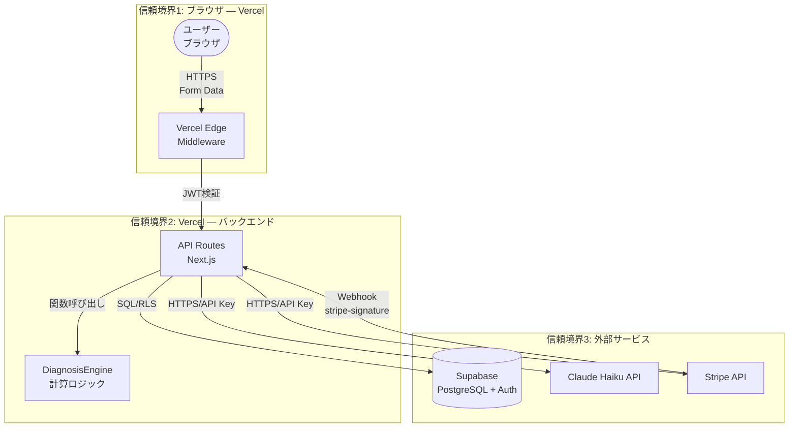

# Threat Model: animal-match

> STRIDE脅威モデル / sdd-full パイプライン生成
> 生成日: 2026-03-19 | spec-slug: animal-match
> 入力: requirements.md (REQ-SEC-001〜004), design.md

---

## 1. 脅威モデル概要

| 項目 | 値 |
|------|-----|
| 手法 | STRIDE |
| 対象 | アニマルマッチ MVP（Phase1） |
| 信頼境界 | ブラウザ↔Vercel Edge、Vercel↔Supabase、Vercel↔Claude API、Vercel↔Stripe |
| リスク評価 | DREAD（Damage/Reproducibility/Exploitability/Affected Users/Discoverability） |

---

## 2. データフロー図（DFD）

---

## 3. STRIDE脅威分析

### T-001: Spoofing（なりすまし）

| ID | 脅威 | 対象 | DREAD | 緩和策 | REQ |
|----|------|------|-------|--------|-----|
| T-001-1 | 他ユーザーのJWTを偽造してマッチングデータにアクセス | Supabase Auth JWT | D:4 R:2 E:2 A:4 D:2 = **14** | Supabase Auth RS256署名検証。JWT秘密鍵はSupabaseが管理。クライアント側ではJWT検証不要（サーバー側RLSが強制） | REQ-SEC-001 |
| T-001-2 | Stripe Webhookを偽装してPremiumステータスを付与 | Stripe Webhook | D:5 R:3 E:2 A:3 D:3 = **16** | `stripe.webhooks.constructEvent` による署名検証。`STRIPE_WEBHOOK_SECRET` はVercel環境変数に格納 | REQ-SEC-002 |
| T-001-3 | メール認証をバイパスして未確認メールでログイン | Supabase Auth | D:3 R:2 E:2 A:2 D:2 = **11** | Supabase Auth設定: `emailConfirmationRequired: true`。メールリンククリック後のみセッション発行 | REQ-006 |

### T-002: Tampering（改ざん）

| ID | 脅威 | 対象 | DREAD | 緩和策 | REQ |
|----|------|------|-------|--------|-----|
| T-002-1 | 診断リクエストの生年月日を改ざんして任意の動物タイプを取得 | POST /api/diagnosis | D:1 R:5 E:5 A:1 D:5 = **17** | サーバー側でZodバリデーション（範囲チェック: 1900-01-01〜2010-12-31）。計算はサーバー側で実行（クライアント側結果は信頼しない） | REQ-SEC-003 |
| T-002-2 | diagnosis_resultsテーブルの他人のレコードを更新 | Supabase DB | D:3 R:2 E:1 A:3 D:2 = **11** | RLSポリシー: `user_id = auth.uid()` でUPDATE制限。Freeユーザーにはdb.update権限なし | REQ-SEC-001 |
| T-002-3 | ニックネームにHTMLタグ/スクリプトを注入 | フロントエンド | D:3 R:4 E:3 A:4 D:4 = **18** | Zodスキーマ: `regex(/^[^\u0000-\u001F<>&"'/\\]+$/)` で制御文字・HTMLメタ文字禁止。React JSX自動エスケープ | REQ-SEC-003 |

### T-003: Repudiation（否認）

| ID | 脅威 | 対象 | DREAD | 緩和策 | REQ |
|----|------|------|-------|--------|-----|
| T-003-1 | Premium課金したが「課金していない」と否認 | Stripe決済 | D:2 R:3 E:2 A:2 D:3 = **12** | Stripe Dashboardに課金履歴保存。Webhookログを構造化ログに記録（タイムスタンプ・customer_id・event_type） | REQ-007 |
| T-003-2 | 診断結果を「受け取っていない」と否認 | 診断API | D:1 R:3 E:3 A:1 D:3 = **11** | diagnosis_resultsテーブルにcreated_at記録。APIレスポンスログにrequest_id付与 | REQ-LOG-001 |

### T-004: Information Disclosure（情報漏洩）

| ID | 脅威 | 対象 | DREAD | 緩和策 | REQ |
|----|------|------|-------|--------|-----|
| T-004-1 | 他ユーザーの生年月日・メールアドレスの漏洩 | usersテーブル | D:5 R:3 E:2 A:5 D:3 = **18** | RLS: `auth.uid() = id` でSELECT制限。マッチングAPIではnickname・animal_typeのみ返却（email・birthdate非公開） | REQ-SEC-001, REQ-903 |
| T-004-2 | APIキー（ANTHROPIC_API_KEY等）がクライアントに漏洩 | 環境変数 | D:5 R:2 E:1 A:5 D:2 = **15** | `NEXT_PUBLIC_` プレフィックスなし→サーバー側のみ。Vercel環境変数は暗号化保存。`.env.local` を `.gitignore` に追加 | REQ-SEC-001 |
| T-004-3 | 診断結果の share_token が推測可能 | share_token | D:2 R:3 E:3 A:3 D:4 = **15** | `crypto.randomUUID()` でUUID v4生成（推測不可能な128bit乱数） | REQ-005 |
| T-004-4 | エラーレスポンスにスタックトレースが含まれる | APIエラーハンドリング | D:2 R:4 E:4 A:3 D:4 = **17** | 本番環境: `{ error: "ERROR_CODE", message: "ユーザー向けメッセージ" }` のみ返却。スタックトレースはサーバーログにのみ出力 | REQ-SEC-003 |

### T-005: Denial of Service（サービス拒否）

| ID | 脅威 | 対象 | DREAD | 緩和策 | REQ |
|----|------|------|-------|--------|-----|
| T-005-1 | 診断APIへの大量リクエストでClaude Haiku APIコスト増大 | POST /api/diagnosis | D:4 R:5 E:5 A:5 D:5 = **24** | レート制限: 同一IPから1分5リクエスト（Upstash Redis + Edge Middleware）。Haikuキャッシュで12種以降はAPI呼び出しなし | REQ-SEC-004 |
| T-005-2 | Supabase DB接続プール枯渇 | PostgreSQL | D:4 R:3 E:3 A:5 D:3 = **18** | PgBouncer経由接続。Vercel Serverless関数のmax concurrent設定。Supabase Pro Plan検討（Phase2） | REQ-902 |
| T-005-3 | OGP画像生成の大量リクエスト | GET /api/og | D:2 R:4 E:5 A:3 D:4 = **18** | Edge Runtime + CDNキャッシュ（Cache-Control: public, max-age=86400）。レート制限適用 | REQ-005 |

### T-006: Elevation of Privilege（権限昇格）

| ID | 脅威 | 対象 | DREAD | 緩和策 | REQ |
|----|------|------|-------|--------|-----|
| T-006-1 | FreeユーザーがPremiumマッチング機能にアクセス | GET /api/matches | D:3 R:4 E:3 A:3 D:4 = **17** | サーバー側で `users.subscription_status = 'premium'` をチェック。RLSポリシーでDB層でもブロック。クライアント側表示制御はバイパス可能なためサーバー検証必須 | REQ-008, REQ-SEC-001 |
| T-006-2 | Stripe Webhookイベント偽装でsubscription_statusをpremiumに変更 | Webhook handler | D:4 R:2 E:2 A:3 D:3 = **14** | T-001-2と同一緩和策。署名検証 + event.data.object からcustomer_idを取得しDB照合 | REQ-SEC-002 |

---

## 4. リスク優先度マトリクス

| DREAD | 脅威ID | 脅威 | 優先度 |
|-------|--------|------|--------|
| 24 | T-005-1 | 診断API DoS / コスト増大 | **Critical** |
| 18 | T-002-3 | XSS（ニックネーム注入） | **High** |
| 18 | T-004-1 | 個人情報漏洩 | **High** |
| 18 | T-005-2 | DB接続プール枯渇 | **High** |
| 18 | T-005-3 | OGP画像DoS | **High** |
| 17 | T-002-1 | 生年月日改ざん | Medium |
| 17 | T-004-4 | スタックトレース漏洩 | Medium |
| 17 | T-006-1 | Premium機能不正アクセス | Medium |
| 16 | T-001-2 | Webhook偽装 | Medium |
| 15 | T-004-2 | APIキー漏洩 | Medium |
| 15 | T-004-3 | share_token推測 | Medium |
| 14 | T-001-1 | JWT偽造 | Low |
| 14 | T-006-2 | Webhook経由権限昇格 | Low |
| 12 | T-003-1 | 課金否認 | Low |
| 11 | T-001-3 | メール認証バイパス | Low |
| 11 | T-002-2 | DB改ざん | Low |
| 11 | T-003-2 | 診断否認 | Low |

---

## 5. 緩和策実装チェックリスト

### Critical（Phase1必須）

- [ ] レート制限: Upstash Redis + Edge Middleware（TASK-009内で実装）
- [ ] Haikuキャッシュ: 12動物タイプ固定→メモリキャッシュ（TASK-007内で実装）

### High（Phase1必須）

- [ ] Zodバリデーション: ニックネームのHTML特殊文字禁止（TASK-008）
- [ ] RLS: 全テーブルに `auth.uid()` ベースのポリシー（TASK-002）
- [ ] マッチングAPI: email/birthdate非公開、nickname/animal_typeのみ返却（TASK-017）
- [ ] PgBouncer接続プール設定確認（TASK-002）
- [ ] OGP CDNキャッシュ設定（TASK-012）

### Medium（Phase1推奨）

- [ ] エラーレスポンス: スタックトレース非公開（全API Route共通ハンドラ）
- [ ] Stripe Webhook署名検証（TASK-016）
- [ ] Premium判定: サーバー側チェック必須（TASK-017）
- [ ] 環境変数: `NEXT_PUBLIC_` プレフィックス確認（TASK-001）
- [ ] share_token: `crypto.randomUUID()` 使用（TASK-012）

---

## 6. 脅威↔REQ トレーサビリティ

| 脅威ID | REQ | 緩和タスク |
|--------|-----|-----------|
| T-001-1 | REQ-SEC-001 | TASK-002, TASK-003 |
| T-001-2 | REQ-SEC-002 | TASK-016 |
| T-002-1 | REQ-SEC-003 | TASK-008, TASK-009 |
| T-002-3 | REQ-SEC-003 | TASK-008 |
| T-004-1 | REQ-SEC-001, REQ-903 | TASK-002, TASK-017 |
| T-005-1 | REQ-SEC-004 | TASK-009 |
| T-006-1 | REQ-008, REQ-SEC-001 | TASK-017 |
