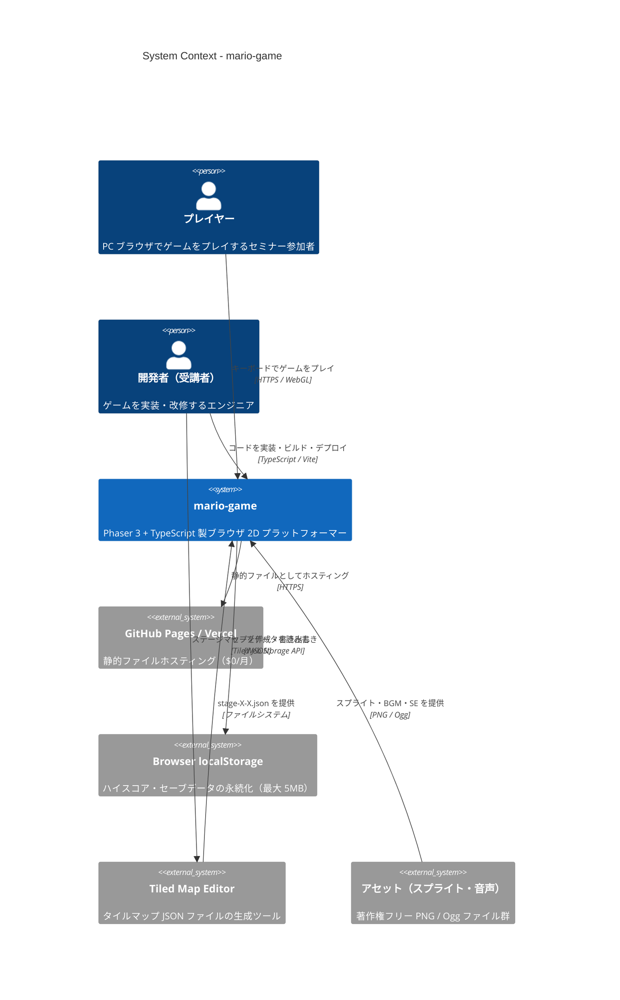
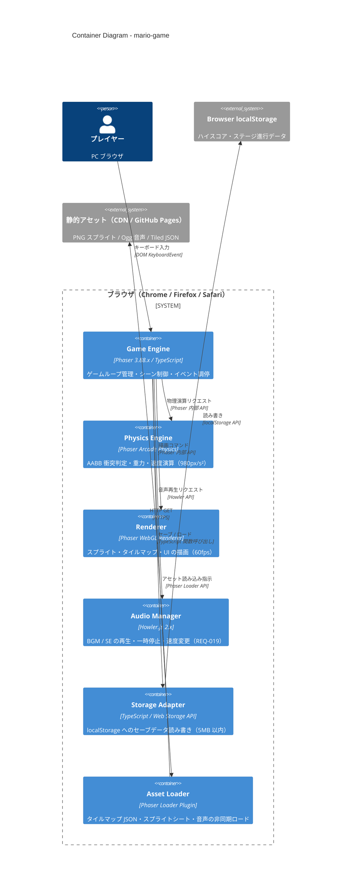
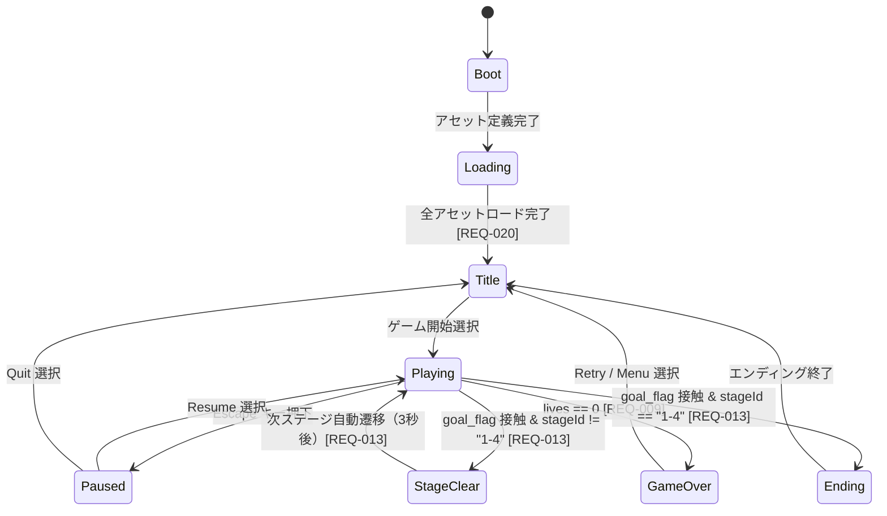
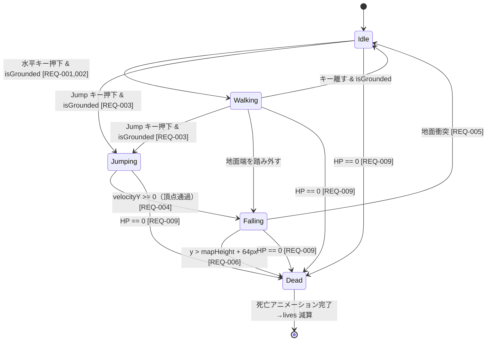
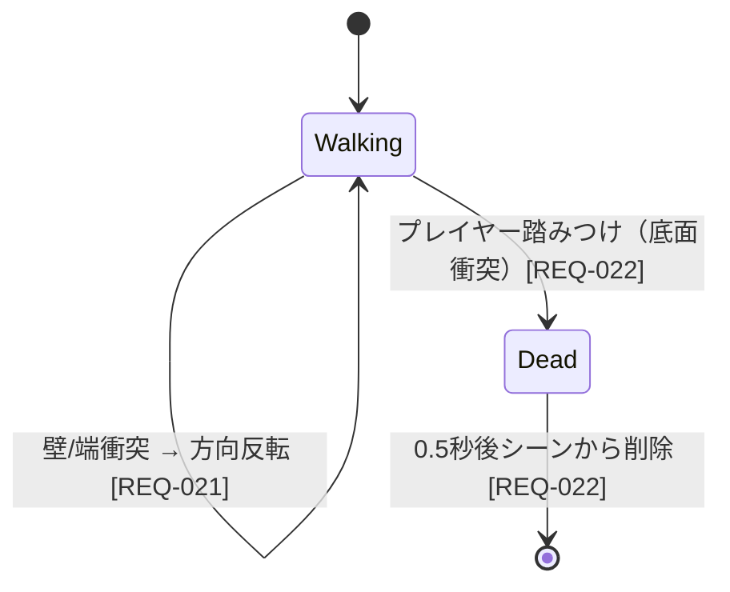
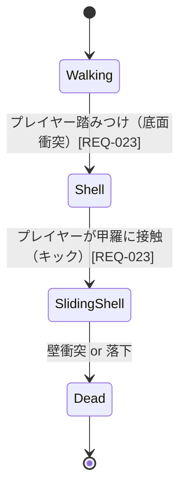

# Design: mario-game

## 1. 概要

### 設計方針

本ドキュメントは C4 モデル（Context / Container / Component / Code）に準拠し、Phaser 3.88.x + TypeScript によるブラウザ動作型 2D プラットフォーマーゲームのアーキテクチャを定義する。

**核心原則**:

- **イミュータブルデータ**: 全ゲーム状態は `readonly` フィールドで定義し、状態変更は新オブジェクト生成で行う
- **シーン分離**: Phaser 3 のシーンシステムを活用し、責務を明確に分割する
- **単方向データフロー**: Input → Logic → State → Render の一方向フローを維持する
- **ファイルサイズ制限**: 1 ファイル最大 400 行（CON-007 準拠）
- **型安全性**: TypeScript strict モード有効（CON-002 準拠）

---

## 2. C4 System Context 図



---

## 3. C4 Container 図



---

## 4. C4 Component 図（Game Engine 内部）

```mermaid
C4Component
  title Component Diagram - Game Engine (Phaser Scenes & Managers)

  Container_Boundary(gameEngine, "Game Engine") {

    Component(bootScene, "BootScene", "Phaser.Scene", "アセット定義・初期設定のみ。LoadingScene へ遷移 [REQ-020]")
    Component(loadingScene, "LoadingScene", "Phaser.Scene", "非同期アセットロード・プログレスバー表示 [REQ-020]")
    Component(titleScene, "TitleScene", "Phaser.Scene", "タイトル画面・ゲーム開始トリガー")
    Component(gameScene, "GameScene", "Phaser.Scene", "メインゲームループ。各 Manager を保持・調停 [REQ-011]")
    Component(uiScene, "UIScene", "Phaser.Scene", "HUD（スコア・ライフ・タイマー）を並行描画 [REQ-018]")
    Component(pauseScene, "PauseScene", "Phaser.Scene", "一時停止画面・Resume / Quit")
    Component(gameOverScene, "GameOverScene", "Phaser.Scene", "ゲームオーバー表示・ハイスコア保存 [REQ-009]")
    Component(stageClearScene, "StageClearScene", "Phaser.Scene", "ステージクリア演出・次ステージ遷移 [REQ-013]")
    Component(endingScene, "EndingScene", "Phaser.Scene", "最終ステージクリア後エンディング表示 [REQ-013]")

    Component(sceneManager, "SceneManager", "TypeScript class", "シーン遷移ルールの集約。遷移先を決定する")
    Component(inputManager, "InputManager", "TypeScript class", "キー状態を正規化して提供 [REQ-001〜003]")
    Component(entityManager, "EntityManager", "TypeScript class", "Player・Enemy・Item エンティティのライフサイクル管理")
    Component(collisionSystem, "CollisionSystem", "TypeScript class", "Arcade Physics グループ間の衝突コールバック登録 [REQ-005〜008]")
    Component(cameraController, "CameraController", "TypeScript class", "プレイヤー追従・境界クランプ [REQ-014〜015]")
    Component(tilemapLoader, "TilemapLoader", "TypeScript class", "Tiled JSON パース・レイヤー生成・オブジェクト抽出 [REQ-011]")
    Component(enemyAI, "EnemyAI", "TypeScript class", "Goomba / KoopaTroopa の移動・方向転換ロジック [REQ-021〜030]")
    Component(itemSystem, "ItemSystem", "TypeScript class", "コイン・パワーアップのスポーン・取得処理 [REQ-031〜040]")
    Component(scoreSystem, "ScoreSystem", "TypeScript class", "スコア加算・ハイスコア比較 [REQ-041〜050]")
    Component(timerSystem, "TimerSystem", "TypeScript class", "カウントダウン・BGM 速度変更トリガー [REQ-018〜019]")
    Component(audioController, "AudioController", "TypeScript class", "Howler.js ラッパー。BGM / SE 再生管理 [REQ-051〜060]")
    Component(saveManager, "SaveManager", "TypeScript class", "StorageAdapter 経由のセーブ / ロード [REQ-061〜070]")
  }

  Rel(bootScene, loadingScene, "遷移")
  Rel(loadingScene, titleScene, "ロード完了後遷移")
  Rel(titleScene, gameScene, "ゲーム開始")
  Rel(gameScene, sceneManager, "状態変化通知")
  Rel(sceneManager, pauseScene, "Pause 遷移")
  Rel(sceneManager, gameOverScene, "Game Over 遷移")
  Rel(sceneManager, stageClearScene, "Clear 遷移")
  Rel(sceneManager, endingScene, "Ending 遷移")
  Rel(gameScene, inputManager, "入力状態取得")
  Rel(gameScene, entityManager, "エンティティ更新")
  Rel(gameScene, collisionSystem, "衝突判定")
  Rel(gameScene, cameraController, "カメラ更新")
  Rel(gameScene, tilemapLoader, "マップ生成")
  Rel(entityManager, enemyAI, "敵 AI 更新")
  Rel(entityManager, itemSystem, "アイテム処理")
  Rel(collisionSystem, scoreSystem, "スコア加算")
  Rel(collisionSystem, audioController, "SE 再生")
  Rel(timerSystem, audioController, "BGM 速度変更")
  Rel(gameScene, saveManager, "セーブ / ロード")
  Rel(gameScene, uiScene, "HUD データ通知", "Phaser EventEmitter")
```



---

## 5. データモデル（TypeScript Interface）

全フィールドは `readonly` によりイミュータブル設計。状態更新は新オブジェクト生成（スプレッド構文）で行う。

```typescript
// src/models/player.ts

export interface PlayerState {
  readonly id: string;
  readonly x: number;
  readonly y: number;
  readonly velocityX: number;
  readonly velocityY: number;
  readonly isGrounded: boolean;
  readonly isInvincible: boolean;
  readonly invincibleEndTime: number; // Unix ms
  readonly hp: number;               // 1=小, 2=大, 3=ファイア
  readonly lives: number;            // 初期値 3
  readonly facingDirection: "left" | "right";
  readonly animationState: PlayerAnimState;
}

export type PlayerAnimState =
  | "idle"
  | "walking"
  | "jumping"
  | "falling"
  | "dead"
  | "growing"
  | "shrinking";
```

```typescript
// src/models/enemy.ts

export type EnemyType = "goomba" | "koopa_walking" | "koopa_shell";

export interface Enemy {
  readonly id: string;
  readonly type: EnemyType;
  readonly x: number;
  readonly y: number;
  readonly velocityX: number;
  readonly velocityY: number;
  readonly alive: boolean;
  readonly shellVelocityX: number; // KoopaTroopa 甲羅専用
  readonly deadTimestamp: number | null; // 死亡 SE 後削除タイミング
}
```

```typescript
// src/models/item.ts

export type ItemType = "coin" | "mushroom" | "fireflower" | "star";

export interface Item {
  readonly id: string;
  readonly type: ItemType;
  readonly x: number;
  readonly y: number;
  readonly collected: boolean;
  readonly scoreValue: number; // coin=100, mushroom=1000, etc.
}
```

```typescript
// src/models/level.ts

export interface TileLayer {
  readonly name: "ground" | "platform" | "decoration";
  readonly data: readonly number[]; // タイル ID 配列（左上から右下）
  readonly width: number;           // タイル数
  readonly height: number;
}

export interface MapObject {
  readonly id: number;
  readonly type: "goal_flag" | "pipe_entrance" | "enemy_spawn" | "item_block";
  readonly x: number;
  readonly y: number;
  readonly width: number;
  readonly height: number;
  readonly properties: Readonly<Record<string, string | number | boolean>>;
}

export interface LevelData {
  readonly stageId: string;          // "1-1" | "1-2" | "1-3" | "1-4"
  readonly mapWidth: number;         // px
  readonly mapHeight: number;        // px
  readonly tileWidth: number;        // 16
  readonly tileHeight: number;       // 16
  readonly layers: readonly TileLayer[];
  readonly objects: readonly MapObject[];
  readonly bgmKey: string;           // Howler サウンドキー
  readonly parallaxKey: string;      // 背景スプライトキー
}
```

```typescript
// src/models/save.ts

export interface StageProgress {
  readonly stageId: string;
  readonly cleared: boolean;
  readonly bestTime: number; // 残り秒数（高いほど速クリア）
}

export interface SaveData {
  readonly version: number;          // セーブフォーマットバージョン
  readonly highScore: number;
  readonly stageProgress: readonly StageProgress[];
  readonly savedAt: number;          // Unix ms
}
```

```typescript
// src/models/game-state.ts

export type GamePhase =
  | "boot"
  | "loading"
  | "title"
  | "playing"
  | "paused"
  | "game_over"
  | "stage_clear"
  | "ending";

export interface GameState {
  readonly phase: GamePhase;
  readonly currentStageId: string;
  readonly score: number;
  readonly lives: number;
  readonly timer: number;   // 残り秒数（0〜400）
  readonly player: PlayerState;
  readonly enemies: readonly Enemy[];
  readonly items: readonly Item[];
}
```

---

## 6. 状態遷移図

### 6.1 ゲーム全体フロー



### 6.2 プレイヤー状態遷移



### 6.3 敵（Goomba）状態遷移



### 6.4 敵（KoopaTroopa）状態遷移



---

## 7. レベルデータフォーマット（Tiled JSON 対応）

Tiled Map Editor が出力する JSON 仕様との対応表を示す。Phaser 3 の `this.make.tilemap()` が直接読み込めるフォーマットを前提とする（ASM-003 準拠）。

### 7.1 ファイル配置

```
public/
  assets/
    maps/
      stage-1-1.json    # REQ-012
      stage-1-2.json
      stage-1-3.json
      stage-1-4.json
    tilesets/
      tileset-world1.png
    audio/
      bgm-overworld.ogg
      se-coin.ogg
      se-stomp.ogg
      se-powerup.ogg
      se-death.ogg
      se-stage-clear.ogg
    sprites/
      player.png        # スプライトシート
      enemies.png
      items.png
```

### 7.2 Tiled JSON レイヤー定義

| Tiled レイヤー名 | type       | 用途                                 | Phaser 対応 |
|----------------|------------|--------------------------------------|------------|
| `ground`       | tilelayer  | 地面・壁タイル（衝突あり）             | `setCollisionByExclusion([-1])` |
| `platform`     | tilelayer  | 通過プラットフォーム（上面のみ衝突）   | `setCollisionByExclusion([-1])` |
| `decoration`   | tilelayer  | 装飾タイル（衝突なし）                | レンダリングのみ |
| `objects`      | objectgroup | ゴール・パイプ・敵スポーン位置       | `getObjectLayer("objects")` |

### 7.3 オブジェクトプロパティ定義

| type           | 必須プロパティ         | 説明                              |
|----------------|----------------------|-----------------------------------|
| `goal_flag`    | なし                 | プレイヤー接触でステージクリア [REQ-013] |
| `pipe_entrance`| `targetStageId: string` | 接続先サブステージ ID [REQ-017] |
| `enemy_spawn`  | `enemyType: EnemyType` | スポーンする敵の種類 [REQ-021〜030] |
| `item_block`   | `itemType: ItemType`  | ヒットで出現するアイテム [REQ-031〜040] |

---

## 8. REQ → 設計トレーサビリティ

| REQ ID  | 要件概要                          | 対応コンポーネント                        |
|---------|----------------------------------|------------------------------------------|
| REQ-001 | 右移動 200px/s                   | `InputManager`, `PlayerState.velocityX` |
| REQ-002 | 左移動 200px/s                   | `InputManager`, `PlayerState.velocityX` |
| REQ-003 | ジャンプ -600px/s インパルス      | `InputManager`, `CollisionSystem`        |
| REQ-004 | 重力 980px/s²（最大 800px/s）    | Arcade Physics グローバル設定            |
| REQ-005 | 地面衝突 → isGrounded=true       | `CollisionSystem`, `PlayerState`         |
| REQ-006 | 落下死（y > mapHeight+64px）     | `GameScene.update()`, `SceneManager`     |
| REQ-007 | 敵踏みつけ → バウンス -400px/s   | `CollisionSystem`, `EnemyAI`             |
| REQ-008 | 側面衝突 → HP-1・無敵 2 秒       | `CollisionSystem`, `PlayerState`         |
| REQ-009 | HP=0 → 死亡・lives-1・再スタート | `SceneManager`, `GameOverScene`          |
| REQ-010 | 走りアニメーション 8fps           | `EntityManager`（Phaser AnimationManager）|
| REQ-011 | GameScene 初期化 → タイルマップ描画 | `TilemapLoader`, `GameScene.create()`  |
| REQ-012 | ステージ 1-1〜1-4 の JSON 存在    | `TilemapLoader`, 静的アセット配置        |
| REQ-013 | ゴール接触 → 次ステージ / Ending  | `CollisionSystem`, `SceneManager`        |
| REQ-014 | カメラ水平追従（中央 40%）         | `CameraController`                       |
| REQ-015 | カメラ左境界クランプ               | `CameraController`                       |
| REQ-016 | 視差背景 0.3x スクロール           | `CameraController`（tileSprite オフセット）|
| REQ-017 | パイプ入口 → サブステージ遷移      | `MapObject[type=pipe_entrance]`, `SceneManager` |
| REQ-018 | 400 秒カウントダウン              | `TimerSystem`, `UIScene`                 |
| REQ-019 | タイマー 100 秒 → BGM 1.5x       | `TimerSystem`, `AudioController`         |
| REQ-020 | 非同期ロード・プログレスバー        | `LoadingScene`, `AssetLoader`            |
| REQ-021 | Goomba AI（往復 60px/s）         | `EnemyAI`                                |
| REQ-022 | Goomba 踏みつけ → 0.5 秒後削除   | `CollisionSystem`, `EntityManager`       |
| REQ-023 | KoopaTroopa → 甲羅 → キック       | `CollisionSystem`, `EnemyAI`             |

---

## 9. ディレクトリ構成

```
src/
  scenes/
    BootScene.ts
    LoadingScene.ts
    TitleScene.ts
    GameScene.ts
    UIScene.ts
    PauseScene.ts
    GameOverScene.ts
    StageClearScene.ts
    EndingScene.ts
  systems/
    InputManager.ts
    EntityManager.ts
    CollisionSystem.ts
    CameraController.ts
    TilemapLoader.ts
    EnemyAI.ts
    ItemSystem.ts
    ScoreSystem.ts
    TimerSystem.ts
    AudioController.ts
  managers/
    SceneManager.ts
    SaveManager.ts
    StorageAdapter.ts
  models/
    player.ts
    enemy.ts
    item.ts
    level.ts
    save.ts
    game-state.ts
  config/
    constants.ts      # GRAVITY, PLAYER_SPEED, JUMP_VELOCITY 等
    phaser.config.ts  # Phaser.Types.Core.GameConfig
  main.ts
public/
  assets/
    maps/
    tilesets/
    audio/
    sprites/
```

---

## 10. 非機能要件への対応

| 要件 | 対応方針 |
|------|---------|
| 初期ロード 5 秒以内（SM-001, CON-006） | Vite コード分割・アセット最適化・WebP/Ogg 使用 |
| 60fps 維持 95%（SM-002） | Arcade Physics（軽量 AABB）・Object Pooling でメモリ確保 |
| TS コンパイルエラー 0（SM-003） | strict: true・readonly 全フィールド適用 |
| テストカバレッジ 80%（SM-004） | Vitest + systems/ ユニットテスト優先 |
| Lighthouse 85 以上（SM-005） | 静的ファイル・HTTP キャッシュヘッダ設定 |
| ブラウザ互換性（SM-006） | WebGL 必須（ASM-002）・ES2020 ターゲット |
| $0 運用（CON-001） | GitHub Pages / Vercel 無料プラン |
