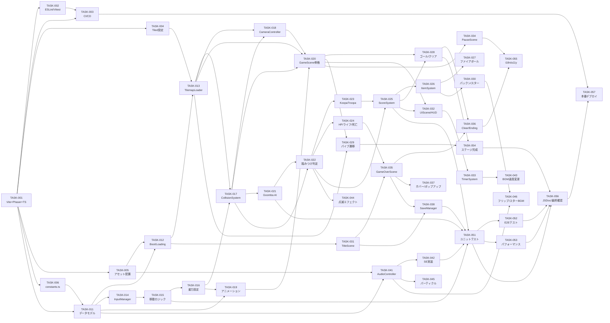
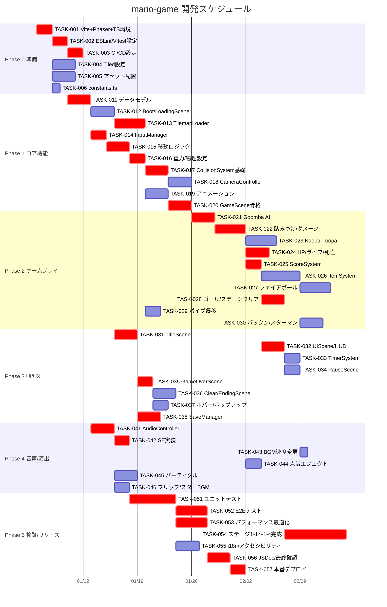

# Tasks: mario-game

## 概要

| 項目 | 値 |
|------|-----|
| タスク総数 | 42 |
| フェーズ数 | 6（Phase 0〜5） |
| クリティカルパス | TASK-001 → TASK-003 → TASK-011 → TASK-012 → TASK-013 → TASK-021 → TASK-022 → TASK-031 → TASK-041 → TASK-051 → TASK-052 |

---

## Phase 0: 準備（環境構築・CI/CD）

### TASK-001

- **タイトル**: Vite + Phaser 3 + TypeScript プロジェクト初期化
- **説明**: `npm create vite@latest` で TypeScript テンプレートを生成し、Phaser 3.88.x・Howler.js 2.x を依存関係として追加する。`tsconfig.json` に `strict: true` と `ES2020` ターゲットを設定する。
- **Implements**: REQ-904, REQ-907, CON-002, CON-003, CON-004
- **依存タスク**: なし
- **見積もり**: 2h
- **優先度**: MUST

### TASK-002

- **タイトル**: ESLint・Prettier・Vitest 設定
- **説明**: `.eslintrc`・`.prettierrc` を作成し、`vitest.config.ts` にカバレッジ（c8 / v8）を設定して `npm test` コマンドを通じて実行できるようにする。
- **Implements**: REQ-905, REQ-906, REQ-916
- **依存タスク**: TASK-001
- **見積もり**: 2h
- **優先度**: MUST

### TASK-003

- **タイトル**: GitHub Actions CI/CD ワークフロー設定
- **説明**: `.github/workflows/ci.yml` を作成し、PR 時に `tsc --noEmit`・`eslint`・`vitest run --coverage` を実行するジョブと、main ブランチ push 時に `vite build` → GitHub Pages デプロイを行うジョブを定義する。
- **Implements**: REQ-908, REQ-909, REQ-916
- **依存タスク**: TASK-001, TASK-002
- **見積もり**: 2h
- **優先度**: MUST

### TASK-004

- **タイトル**: Tiled Map Editor セットアップとステージ JSON スキャフォルド
- **説明**: Tiled Map Editor で 16×16px タイルセットを設定し、`stage-1-1.json`〜`stage-1-4.json` の空テンプレートを `public/assets/maps/` に配置する。`ground`・`platform`・`decoration`・`objects` レイヤーを含める。
- **Implements**: REQ-011, REQ-012
- **依存タスク**: TASK-001
- **見積もり**: 3h
- **優先度**: MUST

### TASK-005

- **タイトル**: アセット配置とディレクトリ構成確定
- **説明**: `public/assets/` 以下に `maps/`・`tilesets/`・`audio/`・`sprites/` ディレクトリを作成し、著作権フリーのスプライトシート・Ogg 音声ファイル・tileset PNG を配置する。
- **Implements**: REQ-020, ASM-005
- **依存タスク**: TASK-001
- **見積もり**: 3h
- **優先度**: MUST

### TASK-006

- **タイトル**: `src/config/constants.ts` 定数ファイル作成
- **説明**: `PLAYER_SPEED = 200`・`JUMP_VELOCITY = -600`・`GRAVITY = 980`・`MAX_FALL_SPEED = 800` 等すべてのゲーム定数を一か所に集約し、シーンファイルへのマジックナンバー埋め込みを禁止する。
- **Implements**: REQ-917
- **依存タスク**: TASK-001
- **見積もり**: 1h
- **優先度**: SHOULD

---

## Phase 1: コア機能（プレイヤー・物理・タイルマップ）

### TASK-011

- **タイトル**: データモデル定義（`src/models/`）
- **説明**: `player.ts`・`enemy.ts`・`item.ts`・`level.ts`・`save.ts`・`game-state.ts` に設計書記載の `readonly` インターフェースをすべて実装し、TypeScript strict モードで 0 エラーを確認する。
- **Implements**: REQ-904, CON-002
- **依存タスク**: TASK-001, TASK-006
- **見積もり**: 3h
- **優先度**: MUST

### TASK-012

- **タイトル**: `BootScene` / `LoadingScene` 実装
- **説明**: `BootScene` でアセットキーを定義して `LoadingScene` へ遷移し、`LoadingScene` で全アセットを非同期ロードしながらプログレスバーを 10% 刻みで更新する。タイムアウト 30 秒でエラー表示とリロードボタンを出す。
- **Implements**: REQ-020
- **依存タスク**: TASK-005, TASK-011
- **見積もり**: 3h
- **優先度**: SHOULD

### TASK-013

- **タイトル**: `TilemapLoader` 実装
- **説明**: `Phaser.Scene.make.tilemap()` で Tiled JSON を読み込み、`ground`・`platform`・`decoration` レイヤーを描画し、`objects` レイヤーからオブジェクトを抽出する。ロード失敗時はログ出力してタイトルへ戻る。
- **Implements**: REQ-011, REQ-012
- **依存タスク**: TASK-004, TASK-012
- **見積もり**: 4h
- **優先度**: MUST

### TASK-014

- **タイトル**: `InputManager` 実装
- **説明**: `Phaser.Input.Keyboard` を使いキー状態を正規化して `isLeft`・`isRight`・`isJump`・`isDown`・`isFire` を提供するクラスを実装する。テストはモック入力で右移動・左移動・ジャンプの 3 ケースを検証する。
- **Implements**: REQ-001, REQ-002, REQ-003
- **依存タスク**: TASK-011
- **見積もり**: 2h
- **優先度**: MUST

### TASK-015

- **タイトル**: プレイヤー移動・ジャンプ物理ロジック実装
- **説明**: `InputManager` の状態を受け取り、`PlayerState` を新オブジェクト生成で更新（右移動 200px/s、左移動 200px/s、ジャンプ -600px/s）する純粋関数を TDD で実装する。空中ジャンプ無効化も含める。
- **Implements**: REQ-001, REQ-002, REQ-003
- **依存タスク**: TASK-014
- **見積もり**: 3h
- **優先度**: MUST

### TASK-016

- **タイトル**: Arcade Physics 重力・最大落下速度設定
- **説明**: `phaser.config.ts` の `physics.arcade.gravity.y = 980` を設定し、`GameScene.create()` でプレイヤーの `maxVelocityY = 800` を設定する。ジャンプ頂点通過後の落下加速テストを作成する。
- **Implements**: REQ-004
- **依存タスク**: TASK-015
- **見積もり**: 2h
- **優先度**: MUST

### TASK-017

- **タイトル**: `CollisionSystem` 基礎衝突判定実装
- **説明**: プレイヤーと ground/platform タイルの衝突を登録し、地面衝突時に `isGrounded = true`・`velocityY = 0` にする。落下死判定（`y > mapHeight + 64`）も実装する。
- **Implements**: REQ-005, REQ-006
- **依存タスク**: TASK-013, TASK-016
- **見積もり**: 3h
- **優先度**: MUST

### TASK-018

- **タイトル**: `CameraController` 実装
- **説明**: プレイヤーをカメラ中央 40% に追従させ、左境界クランプ（x < 0 不可）とマップ右端クランプを実装する。視差背景 tileSprite のオフセットを 0.3x で計算・更新する処理も含める。
- **Implements**: REQ-014, REQ-015, REQ-016
- **依存タスク**: TASK-013, TASK-017
- **見積もり**: 3h
- **優先度**: MUST

### TASK-019

- **タイトル**: プレイヤーアニメーション実装
- **説明**: `Phaser.AnimationManager` で idle・walking（8fps）・jumping・falling・dead・growing・shrinking のアニメーションキーを定義し、`PlayerState.animationState` に応じて再生を切り替える。
- **Implements**: REQ-010
- **依存タスク**: TASK-011, TASK-016
- **見積もり**: 3h
- **優先度**: SHOULD

### TASK-020

- **タイトル**: `GameScene` 基礎骨格と `SceneManager` 実装
- **説明**: `GameScene.create()` で TilemapLoader・InputManager・CollisionSystem・CameraController を初期化し、`update()` でゲームループを回す骨格を実装する。`SceneManager` にシーン遷移ルールを集約する。
- **Implements**: REQ-011
- **依存タスク**: TASK-013, TASK-017, TASK-018, TASK-019
- **見積もり**: 3h
- **優先度**: MUST

---

## Phase 2: ゲームプレイ（敵・アイテム・スコア・ライフ）

### TASK-021

- **タイトル**: `EnemyAI` Goomba 実装
- **説明**: Goomba を 60px/s で往復移動させ、壁・プラットフォーム端での方向反転ロジックを実装する。カメラビューポート外（±512px）では update をスキップする（REQ-025）。
- **Implements**: REQ-021, REQ-025
- **依存タスク**: TASK-013, TASK-017
- **見積もり**: 3h
- **優先度**: MUST

### TASK-022

- **タイトル**: `CollisionSystem` 敵踏みつけ・ダメージ判定
- **説明**: プレイヤー下端と敵上端の衝突でバウンス -400px/s・Goomba 死亡処理（0.5 秒後削除）を実装する。側面衝突では HP-1・2 秒無敵を実装する。無敵中はダメージを無効化する。
- **Implements**: REQ-007, REQ-008, REQ-022
- **依存タスク**: TASK-021
- **見積もり**: 4h
- **優先度**: MUST

### TASK-023

- **タイトル**: `EnemyAI` KoopaTroopa 実装
- **説明**: KoopaTroopa の歩行→甲羅→スライディング甲羅の状態遷移を実装する。甲羅は 400px/s でキックでき、壁衝突で方向反転、他敵に当たると死亡させる。
- **Implements**: REQ-023, REQ-030
- **依存タスク**: TASK-022
- **見積もり**: 4h
- **優先度**: MUST

### TASK-024

- **タイトル**: HP・ライフ・死亡シーケンス実装
- **説明**: HP = 0 で死亡 SE 再生 → lives-1 → 2 秒後ステージ再スタート。lives = 0 でゲームオーバーシーンへ遷移する。落下死（y > mapHeight+64）も同シーケンスで処理する。
- **Implements**: REQ-006, REQ-009
- **依存タスク**: TASK-022
- **見積もり**: 3h
- **優先度**: MUST

### TASK-025

- **タイトル**: `ScoreSystem` スコア加算実装
- **説明**: Goomba 踏みつけ +200pt、コイン +100pt、Koopa 甲羅敵撃破 +100pt のスコア加算を `CollisionSystem` のコールバックから呼び出す。連続踏みコンボ倍率（最大 8x）も実装する（REQ-039）。
- **Implements**: REQ-024, REQ-031, REQ-039
- **依存タスク**: TASK-022, TASK-023
- **見積もり**: 2h
- **優先度**: MUST

### TASK-026

- **タイトル**: `ItemSystem` コイン・パワーアップ実装
- **説明**: ハテナブロック頭突きでコイン/キノコ/フラワーを出現させ、プレイヤー衝突で取得処理（HP更新・スコア加算）を実装する。コイン 100 枚でライフ +1（REQ-032）も含める。
- **Implements**: REQ-031, REQ-032, REQ-033, REQ-034, REQ-035, REQ-037
- **依存タスク**: TASK-025
- **見積もり**: 5h
- **優先度**: MUST

### TASK-027

- **タイトル**: ファイアボール実装
- **説明**: HP=3 時に B/Z キーでファイアボールを 400px/s 発射する。同時存在上限 2 個、タイル衝突で削除、敵衝突で敵を死亡させファイアボールも削除する。オブジェクトプールで管理する（REQ-912）。
- **Implements**: REQ-027, REQ-028, REQ-912
- **依存タスク**: TASK-026
- **見積もり**: 4h
- **優先度**: SHOULD

### TASK-028

- **タイトル**: ゴールフラグ・ステージクリア遷移実装
- **説明**: `goal_flag` オブジェクトにプレイヤーが接触したらクリア演出を再生し、3 秒以内に次ステージを読み込む。ステージ 1-4 クリア時は EndingScene へ遷移する。タイマーボーナス（残り秒 × 50pt）計算も行う。
- **Implements**: REQ-013, REQ-038
- **依存タスク**: TASK-020, TASK-025
- **見積もり**: 3h
- **優先度**: MUST

### TASK-029

- **タイトル**: パイプ入口サブステージ遷移実装
- **説明**: `pipe_entrance` オブジェクト上で下キー 1 秒押しでフェードアウト後サブステージへ遷移する。対応 JSON が存在しない場合は無効化する。
- **Implements**: REQ-017
- **依存タスク**: TASK-013, TASK-020
- **見積もり**: 2h
- **優先度**: SHOULD

### TASK-030

- **タイトル**: パックンフラワー・スターマン実装
- **説明**: パックンフラワーの伸び状態でのダメージ判定（REQ-026）、スターマン取得で 10 秒無敵・特殊 BGM・接触で敵自動死亡（REQ-040）を実装する。
- **Implements**: REQ-026, REQ-040
- **依存タスク**: TASK-026
- **見積もり**: 3h
- **優先度**: SHOULD

---

## Phase 3: UI・UX（メニュー・HUD・ポーズ・ゲームオーバー）

### TASK-031

- **タイトル**: `TitleScene` 実装
- **説明**: PLAY・CONTINUE・HIGH SCORE 表示を含むタイトル画面を実装する。localStorage から High Score を読み込み表示する。ビットマップフォント（16px / 32px）を使用する。
- **Implements**: REQ-041, REQ-042, REQ-060, REQ-048
- **依存タスク**: TASK-012
- **見積もり**: 3h
- **優先度**: MUST

### TASK-032

- **タイトル**: `UIScene` HUD 実装
- **説明**: スコア・コイン数・ライフ数・ワールド番号・タイマーを画面上部に常時表示する並行シーンを実装する。`Phaser.Events.EventEmitter` 経由で `GameScene` からデータ更新を受け取る。
- **Implements**: REQ-036
- **依存タスク**: TASK-020, TASK-025
- **見積もり**: 3h
- **優先度**: SHOULD

### TASK-033

- **タイトル**: `TimerSystem` カウントダウン実装
- **説明**: 400 秒から 1 秒ごとにカウントダウンし UIScene に通知する。タイマー 0 で死亡シーケンス発動、タイマー 100 で BGM 速度 1.5x トリガーを呼び出す。
- **Implements**: REQ-018, REQ-019
- **依存タスク**: TASK-032
- **見積もり**: 2h
- **優先度**: SHOULD

### TASK-034

- **タイトル**: `PauseScene` ポーズメニュー実装
- **説明**: Escape キーでゲームを一時停止し、RESUME・QUIT・MUTE オプションを表示する。再度 Escape でポーズ解除。MUTE で全音声ボリューム 0 / 0.7 トグル。
- **Implements**: REQ-045, REQ-057
- **依存タスク**: TASK-020, TASK-032
- **見積もり**: 2h
- **優先度**: SHOULD

### TASK-035

- **タイトル**: `GameOverScene` ゲームオーバー画面実装
- **説明**: ライフ 0 時に最終スコアと RETRY ボタンを表示する。RETRY クリックでスコア・ライフ・HP をリセットしてステージ 1-1 から再開する。ハイスコアを localStorage に保存する。
- **Implements**: REQ-043, REQ-044, REQ-059
- **依存タスク**: TASK-024, TASK-031
- **見積もり**: 2h
- **優先度**: MUST

### TASK-036

- **タイトル**: `StageClearScene` / `EndingScene` 実装
- **説明**: ステージクリア演出とワールドトランジション画面（2 秒）を実装する。EndingScene では合計スコアとプレイ時間を表示する。
- **Implements**: REQ-046, REQ-047
- **依存タスク**: TASK-028, TASK-035
- **見積もり**: 3h
- **優先度**: SHOULD

### TASK-037

- **タイトル**: ボタンホバー演出・スコアマイルストーンポップアップ
- **説明**: ボタンホバー時に白→黄色（#FFFF00）に 1 フレームで切り替える（REQ-049）。スコア 10,000 到達時にプレイヤー位置に "+10000 BONUS" テキストを 1 秒表示する（REQ-050）。
- **Implements**: REQ-049, REQ-050
- **依存タスク**: TASK-035
- **見積もり**: 2h
- **優先度**: COULD

### TASK-038

- **タイトル**: セーブ・ロード機能実装（`SaveManager` / `StorageAdapter`）
- **説明**: ステージクリア時に score・lives・stage・coins を `mario_save` キーで JSON 保存する。CONTINUE ボタンでロードして保存ステージから再開する。DELETE SAVE でデータ削除とメッセージ表示を実装する。localStorage アクセス失敗時はスキップする。
- **Implements**: REQ-059, REQ-060, REQ-061, REQ-062, REQ-063
- **依存タスク**: TASK-031, TASK-035
- **見積もり**: 3h
- **優先度**: MUST

---

## Phase 4: 音声・演出（BGM・SE・エフェクト・カメラ）

### TASK-041

- **タイトル**: `AudioController` Howler.js ラッパー実装
- **説明**: Howler.js 2.x を薄くラップし BGM ループ再生（volume 0.7）・SE 単発再生・BGM 速度変更・停止・ミュートトグルを提供するクラスを実装する。ブラウザ自動再生ブロック時は最初のユーザー操作後に再生する。
- **Implements**: REQ-051
- **依存タスク**: TASK-005, TASK-011
- **見積もり**: 3h
- **優先度**: MUST

### TASK-042

- **タイトル**: SE 実装（コイン・踏みつけ・ダメージ・ジャンプ・死亡・クリア）
- **説明**: coin（vol 1.0）・stomp（vol 0.9）・damage（vol 1.0）・jump（vol 0.8）・death（BGM停止+ジングル）・stage-clear の各 SE を `AudioController` 経由で対応イベントに紐づける。
- **Implements**: REQ-052, REQ-053, REQ-054, REQ-055, REQ-056
- **依存タスク**: TASK-041, TASK-022, TASK-024, TASK-026
- **見積もり**: 2h
- **優先度**: MUST

### TASK-043

- **タイトル**: BGM 速度変更（タイマー 100 秒）実装
- **説明**: `TimerSystem` からタイマー 100 到達イベントを受け取り、`AudioController.setRate(1.5)` を呼び出す。既に 1.5x の場合は再設定しない。警告 SE を 1 回再生する。
- **Implements**: REQ-019
- **依存タスク**: TASK-033, TASK-041
- **見積もり**: 1h
- **優先度**: SHOULD

### TASK-044

- **タイトル**: プレイヤーダメージ点滅エフェクト
- **説明**: ダメージ時に `Phaser.Tweens` でスプライトを 2 秒間 10Hz で alpha 0/1 を繰り返すアニメーションを実装する。無敵時間終了後に alpha を 1 に戻す。
- **Implements**: REQ-056
- **依存タスク**: TASK-022
- **見積もり**: 2h
- **優先度**: SHOULD

### TASK-045

- **タイトル**: パーティクルエフェクト・オブジェクトプール実装
- **説明**: コイン取得・敵死亡時に 8 個のパーティクルを ±150px/s ランダム速度で飛散させ 0.5 秒でフェードアウトする。`Phaser.GameObjects.Particles` でオブジェクトプール（50 個以上）を実装する（REQ-912）。
- **Implements**: REQ-058, REQ-912
- **依存タスク**: TASK-041
- **見積もり**: 3h
- **優先度**: COULD

### TASK-046

- **タイトル**: 敵スプライトフリップ・スターマン BGM 実装
- **説明**: 方向転換時に `setFlipX` を 1 フレーム以内で更新する（REQ-029）。スターマン取得時は専用 BGM に切り替え、10 秒後元 BGM に戻す（REQ-040）。
- **Implements**: REQ-029, REQ-040
- **依存タスク**: TASK-030, TASK-041
- **見積もり**: 2h
- **優先度**: COULD

---

## Phase 5: 検証・リリース（テスト・最適化・デプロイ・ドキュメント）

### TASK-051

- **タイトル**: ユニットテスト実装（物理・スコア・AI・セーブ）
- **説明**: `InputManager`・物理計算関数・`ScoreSystem`・`EnemyAI` ステートマシン・`SaveManager` の単体テストを Vitest で実装し、カバレッジ 80% 以上を達成する。
- **Implements**: REQ-905, REQ-915
- **依存タスク**: TASK-015, TASK-025, TASK-021, TASK-038
- **見積もり**: 6h
- **優先度**: MUST

### TASK-052

- **タイトル**: 結合・E2E テストとブラウザ互換性確認
- **説明**: Playwright でステージ 1-1 を最初から最後まで通す E2E テストを実装する。Chrome 120・Firefox 120・Safari 17 で手動動作確認を実施し、JS エラーゼロを確認する。
- **Implements**: REQ-903, SM-007
- **依存タスク**: TASK-051
- **見積もり**: 4h
- **優先度**: MUST

### TASK-053

- **タイトル**: パフォーマンス最適化（60fps・初期ロード・バンドルサイズ）
- **説明**: Arcade Physics と Object Pooling で GPU メモリ 256MB 以内・60fps 95% 維持を確認する。Vite コード分割とアセット最適化でバンドルサイズ 10MB 以内・初期ロード 5 秒以内に収める。Lighthouse スコア 85 以上を確認する。
- **Implements**: REQ-900, REQ-901, REQ-902, REQ-911, SM-001, SM-002, SM-005
- **依存タスク**: TASK-051
- **見積もり**: 4h
- **優先度**: MUST

### TASK-054

- **タイトル**: ステージ 1-1〜1-4 コンテンツ完成
- **説明**: Tiled Map Editor で 4 ステージ分のマップを完成させ、敵スポーン・アイテムブロック・ゴールフラグ・パイプ配置をすべて設定してゲームクリア可能にする。
- **Implements**: REQ-012, SM-007
- **依存タスク**: TASK-004, TASK-028
- **見積もり**: 8h
- **優先度**: MUST

### TASK-055

- **タイトル**: 国際化（日本語 / 英語切替）・アクセシビリティ対応
- **説明**: 設定メニューで言語切替（日本語 / 英語）を実装する。キーボードフォーカスインジケーターをコントラスト比 3:1 以上で全インタラクティブ要素に適用する。
- **Implements**: REQ-913, REQ-914
- **依存タスク**: TASK-036, TASK-034
- **見積もり**: 3h
- **優先度**: SHOULD

### TASK-056

- **タイトル**: JSDoc コメント・TypeScript コンパイルゼロエラー最終確認
- **説明**: 全パブリックインターフェースとクラスに JSDoc を付与し TypeDoc でドキュメントを生成する。`tsc --noEmit` でエラー 0 件・`eslint src/` でエラー 0 件を最終確認する。
- **Implements**: REQ-904, REQ-906, REQ-910, REQ-919
- **依存タスク**: TASK-051, TASK-052, TASK-053
- **見積もり**: 3h
- **優先度**: MUST

### TASK-057

- **タイトル**: GitHub Pages 本番デプロイと URL 疎通確認
- **説明**: main ブランチへ push して GitHub Actions デプロイジョブが成功することを確認する。`curl` で HTTPS 200 が 3 秒以内に返ることを確認する。Lazy-load（ステージ 1-2 以降のアセット遅延取得）を検証する。
- **Implements**: REQ-908, REQ-909, REQ-918
- **依存タスク**: TASK-003, TASK-056
- **見積もり**: 2h
- **優先度**: MUST

---

## 依存関係グラフ

---

## Gantt チャート

---

## REQ → TASK トレーサビリティマトリックス

| REQ ID | 要件概要 | 対応 TASK |
|--------|---------|----------|
| REQ-001 | 右移動 200px/s | TASK-015 |
| REQ-002 | 左移動 200px/s | TASK-015 |
| REQ-003 | ジャンプ -600px/s | TASK-015 |
| REQ-004 | 重力 980px/s² | TASK-016 |
| REQ-005 | 地面衝突 isGrounded | TASK-017 |
| REQ-006 | 落下死 y > mapHeight+64 | TASK-017, TASK-024 |
| REQ-007 | 踏みつけバウンス -400px/s | TASK-022 |
| REQ-008 | 側面衝突 HP-1・無敵2秒 | TASK-022 |
| REQ-009 | HP=0 → 死亡・lives-1 | TASK-024 |
| REQ-010 | 走りアニメーション 8fps | TASK-019 |
| REQ-011 | GameScene タイルマップ描画 | TASK-013, TASK-020 |
| REQ-012 | ステージ 1-1〜1-4 JSON 存在 | TASK-004, TASK-054 |
| REQ-013 | ゴール → 次ステージ / Ending | TASK-028 |
| REQ-014 | カメラ水平追従 中央40% | TASK-018 |
| REQ-015 | カメラ左境界クランプ | TASK-018 |
| REQ-016 | 視差背景 0.3x | TASK-018 |
| REQ-017 | パイプ → サブステージ遷移 | TASK-029 |
| REQ-018 | 400秒カウントダウン | TASK-033 |
| REQ-019 | タイマー100秒 → BGM 1.5x | TASK-043 |
| REQ-020 | 非同期ロード・プログレスバー | TASK-012 |
| REQ-021 | Goomba AI 往復60px/s | TASK-021 |
| REQ-022 | Goomba 踏みつけ → 0.5秒削除 | TASK-022 |
| REQ-023 | KoopaTroopa → 甲羅 → キック | TASK-023 |
| REQ-024 | 敵撃破スコア（200/100pt） | TASK-025 |
| REQ-025 | カメラ外敵 AI スキップ | TASK-021 |
| REQ-026 | パックンフラワーダメージ | TASK-030 |
| REQ-027 | ファイアボール敵撃破 | TASK-027 |
| REQ-028 | ファイアボール発射 400px/s | TASK-027 |
| REQ-029 | 敵スプライトフリップ1フレーム | TASK-046 |
| REQ-030 | 甲羅 壁衝突で方向反転 | TASK-023 |
| REQ-031 | コイン取得 +100pt | TASK-026 |
| REQ-032 | コイン100枚 → ライフ+1 | TASK-026 |
| REQ-033 | ハテナブロック → アイテム出現 | TASK-026 |
| REQ-034 | キノコ取得 HP=2 | TASK-026 |
| REQ-035 | フラワー取得 HP=3 | TASK-026 |
| REQ-036 | HUD 常時表示 | TASK-032 |
| REQ-037 | 1UPキノコ → ライフ+1 | TASK-026 |
| REQ-038 | タイマーボーナス ×50pt | TASK-028 |
| REQ-039 | 連続踏み倍率 最大8x | TASK-025 |
| REQ-040 | スターマン 10秒無敵 | TASK-030, TASK-046 |
| REQ-041 | タイトル画面 PLAY/HIGH SCORE | TASK-031 |
| REQ-042 | PLAY クリック → ステージ1-1 | TASK-031 |
| REQ-043 | ゲームオーバー画面 | TASK-035 |
| REQ-044 | RETRY → スコートリセット | TASK-035 |
| REQ-045 | Escape でポーズ | TASK-034 |
| REQ-046 | エンディング画面 スコア/時間 | TASK-036 |
| REQ-047 | ワールドトランジション 2秒 | TASK-036 |
| REQ-048 | ビットマップフォント16/32px | TASK-031 |
| REQ-049 | ボタンホバー 白→黄色 | TASK-037 |
| REQ-050 | スコアマイルストーンポップアップ | TASK-037 |
| REQ-051 | BGM ループ vol 0.7 | TASK-041 |
| REQ-052 | コイン SE vol 1.0 | TASK-042 |
| REQ-053 | 死亡 BGM停止+ジングル | TASK-042 |
| REQ-054 | ジャンプ SE vol 0.8 | TASK-042 |
| REQ-055 | 踏みつけ SE vol 0.9 | TASK-042 |
| REQ-056 | ダメージ SE + 点滅 10Hz | TASK-042, TASK-044 |
| REQ-057 | MUTE トグル | TASK-034 |
| REQ-058 | パーティクル 8個 0.5秒 | TASK-045 |
| REQ-059 | ハイスコア localStorage 保存 | TASK-035, TASK-038 |
| REQ-060 | タイトル ハイスコア表示 | TASK-031, TASK-038 |
| REQ-061 | ゲーム状態 JSON セーブ | TASK-038 |
| REQ-062 | CONTINUE → ロード再開 | TASK-038 |
| REQ-063 | DELETE SAVE | TASK-038 |
| REQ-900 | 60fps 95% 維持 | TASK-053 |
| REQ-901 | 初期ロード 5秒以内 | TASK-053 |
| REQ-902 | バンドルサイズ 10MB以下 | TASK-053 |
| REQ-903 | ブラウザ互換性 | TASK-052 |
| REQ-904 | TypeScript strict 0エラー | TASK-001, TASK-056 |
| REQ-905 | テストカバレッジ 80% | TASK-051 |
| REQ-906 | ESLint 0エラー | TASK-002, TASK-056 |
| REQ-907 | ビルド 60秒以内 | TASK-001 |
| REQ-908 | GitHub Pages デプロイ | TASK-003, TASK-057 |
| REQ-909 | HTTPS 200 3秒以内 | TASK-057 |
| REQ-910 | ソースファイル 400行以下 | TASK-056 |
| REQ-911 | GPU メモリ 256MB以下 | TASK-053 |
| REQ-912 | オブジェクトプール 50個以上 | TASK-027, TASK-045 |
| REQ-913 | フォーカスインジケーター | TASK-055 |
| REQ-914 | 日本語/英語切替 | TASK-055 |
| REQ-915 | ユニットテスト 80%+ | TASK-051 |
| REQ-916 | PR 時 CI 自動実行 | TASK-003 |
| REQ-917 | マジックナンバー定数化 | TASK-006 |
| REQ-918 | ステージアセット遅延ロード | TASK-057 |
| REQ-919 | JSDoc 全パブリック API | TASK-056 |
| CON-001 | $0 インフラ | TASK-003, TASK-057 |
| CON-002 | TypeScript strict | TASK-001 |
| CON-003 | Phaser 3.88.x | TASK-001 |
| CON-004 | Vite ビルドツール | TASK-001 |
| CON-005 | GitHub リポジトリ管理 | TASK-003 |
| CON-006 | 初期ロード 5秒以内 | TASK-053 |
| CON-007 | ソースファイル 400行以下 | TASK-056 |
| ASM-003 | Tiled JSON Phaser互換 | TASK-004 |
| ASM-005 | 著作権フリーアセット | TASK-005 |
| SM-001 | 初期ロード 5秒以内 | TASK-053 |
| SM-002 | 60fps 95% 維持 | TASK-053 |
| SM-003 | TSコンパイルエラー 0 | TASK-056 |
| SM-004 | テストカバレッジ 80% | TASK-051 |
| SM-005 | Lighthouse 85以上 | TASK-053 |
| SM-006 | ブラウザ互換性 | TASK-052 |
| SM-007 | ゲームクリア可能 | TASK-054 |
