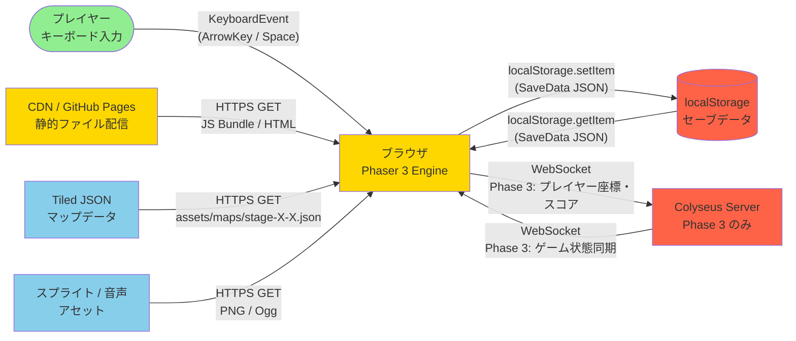

# Threat Model: mario-game

**System Name**: mario-game (マリオ風2Dプラットフォーマー)
**Classification**: Public
**Compliance**: N/A (教育用途・パブリックブラウザゲーム)
**Review Date**: 2026-03-20
**Author**: Security Architect
**対象 Phase**: Phase 1-2（クライアントサイド完結）+ Phase 3（マルチプレイ）追加リスク

---

## Executive Summary

**Security Posture**: Defense-in-Depth（クライアントサイド限定）
**Key Threats**:
1. localStorage セーブデータ改ざん（スコア偽装・アンロック不正）
2. ブラウザコンソールからの JS 実行によるゲーム状態操作
3. Tiled JSON マップデータの不正書き換えによるゲームクラッシュ
4. 悪意ある CDN リソース差し替え（サプライチェーン攻撃）
5. Phase 3: WebSocket 経由のチート・DoS 攻撃

**前提事項（クライアントサイドゲームの本質的制約）**:
- JS ソースコード・アセットはすべてユーザーから閲覧可能（不可避）
- ゲームロジックをクライアントで完結させる以上、完全な改ざん防止は不可能
- Phase 1-2 の緩和策は「攻撃コストを上げる」ことを目的とし、完全防御は目的としない
- Phase 3（マルチプレイ）でサーバーサイド検証を追加することで信頼境界を強化する

---

## 1. 信頼境界の特定

```
[Internet / Attacker]
        |
        v (HTTPS)
+-------+---------------------------+
|  CDN / GitHub Pages / Vercel      |  << 信頼境界 1: 公開ネットワーク → 静的ホスト
|  静的ファイル配信                  |
|  (HTML / JS Bundle / Assets)      |
+-------+---------------------------+
        |
        v (HTTPS fetch)
+-------+---------------------------+
|  ブラウザ（Chrome/Firefox/Safari） |  << 信頼境界 2: ネットワーク → ブラウザ
|                                   |
|  +---------------------------+    |
|  | Phaser 3 Game Engine      |    |  << 信頼境界 3: ブラウザ実行環境内部
|  | (JS Bundle, メモリ上)     |    |     （開発者コード vs ユーザー介入）
|  +---------------------------+    |
|             |                     |
|  +----------+----------+          |
|  | StorageAdapter       |         |  << 信頼境界 4: ゲームエンジン → localStorage
|  | (SaveManager)        |         |     （書き込みデータの整合性）
|  +---------------------+          |
|             |                     |
|  localStorage (5MB 上限)          |
+-----------------------------------+

Phase 3 追加:
+-----------------------------------+
|  Colyseus WebSocket Server        |  << 信頼境界 5: ブラウザ → ゲームサーバー
|  (マルチプレイ同期)               |
+-----------------------------------+
```

### 信頼境界まとめ

| 境界 ID | 境界 | 信頼レベル | リスク |
|--------|------|----------|--------|
| TB-01 | Internet → CDN/GitHub Pages | 外部（低信頼） | ファイル改ざん、MITM |
| TB-02 | CDN → ブラウザ | 半信頼（HTTPS 保護） | サプライチェーン攻撃 |
| TB-03 | ブラウザ実行環境内部 | 低信頼（ユーザー制御可） | コンソール操作、DevTools |
| TB-04 | ゲームエンジン → localStorage | 低信頼（ユーザー書き換え可） | セーブデータ改ざん |
| TB-05 (Phase 3) | ブラウザ → WebSocket Server | 外部（低信頼） | チート、DoS、なりすまし |

---

## 2. データフロー図



### データ分類

| データ | 格納場所 | 機密性 | 整合性要求 |
|--------|---------|--------|-----------|
| SaveData (highScore, stageProgress) | localStorage | 低（公開ゲームスコア） | 中（改ざんで不正解除） |
| PlayerState (座標, HP, lives) | メモリ（JS） | 低 | 中（ゲーム体験の公平性） |
| LevelData / TiledJSON | CDN 静的ファイル | 低 | 高（破損でクラッシュ） |
| JS ソースコード | CDN 静的ファイル | 低（公開前提） | 高（悪意挿入） |
| Phase 3: プレイヤー同期座標 | WebSocket | 低 | 高（チート防止） |

---

## 3. STRIDE 分析表

| ID | 脅威カテゴリ | 脅威 | 影響度(1-5) | 発生確率(1-5) | リスクスコア | 緩和策 ID | 対応 REQ |
|----|------------|------|-----------|-------------|------------|----------|---------|
| T-01 | Spoofing | localStorage の SaveData を別ドメインのスクリプトが読み書きする | 3 | 2 | 6 | M-01 | REQ-061〜070 |
| T-02 | Spoofing | ブラウザコンソールで `saveManager.save()` を直接呼び出し、不正ハイスコアを書き込む | 2 | 4 | 8 | M-02 | REQ-041〜050 |
| T-03 | Tampering | ブラウザ DevTools で localStorage を直接編集し、highScore や stageProgress を改ざんする | 2 | 5 | 10 | M-03, M-04 | REQ-061〜070 |
| T-04 | Tampering | ブラウザコンソールで Phaser シーンオブジェクトを操作し、lives・score・HP を書き換える | 2 | 4 | 8 | M-05 | REQ-001〜009 |
| T-05 | Tampering | Tiled JSON マップファイル（stage-X-X.json）を改ざんし、無効なタイル ID やオブジェクト参照を注入してゲームをクラッシュさせる | 3 | 2 | 6 | M-06, M-07 | REQ-011〜012 |
| T-06 | Tampering | CDN / GitHub Pages の静的ファイルに悪意ある JS を挿入する（サプライチェーン攻撃） | 4 | 1 | 4 | M-08, M-09 | CON-005 |
| T-07 | Tampering | 外部依存ライブラリ（Phaser, Howler.js）の npm パッケージが侵害される | 4 | 1 | 4 | M-10 | CON-003 |
| T-08 | Repudiation | プレイヤーが不正スコアを登録したことを否認する | 1 | 3 | 3 | M-11 | — |
| T-09 | Information Disclosure | JS バンドルのソースマップ（.map ファイル）からゲームロジックが露出する | 2 | 4 | 8 | M-12 | CON-005 |
| T-10 | Information Disclosure | エラーメッセージや console.log にシステム内部情報が露出する | 2 | 3 | 6 | M-13 | — |
| T-11 | Denial of Service | ゲームループ内で無限ループを引き起こすユーザースクリプトを実行し、ブラウザタブをフリーズさせる | 2 | 3 | 6 | M-14 | REQ-004 |
| T-12 | Denial of Service | 大量のエンティティ（enemy/item）を JS から生成してメモリリークを引き起こす | 3 | 3 | 9 | M-15 | REQ-021〜030 |
| T-13 | Denial of Service | localStorage を 5MB 上限まで埋めてセーブ処理を失敗させる | 2 | 2 | 4 | M-16 | REQ-061〜070 |
| T-14 | Elevation of Privilege | Tiled JSON の `item_block` プロパティに不正な itemType 値を入れ、未定義コードパスを実行させる | 3 | 2 | 6 | M-06, M-17 | REQ-031〜040 |
| T-15 | Elevation of Privilege | `pipe_entrance` オブジェクトの `targetStageId` に存在しないステージ ID を入れ、ロードエラーを引き起こす | 3 | 2 | 6 | M-06, M-18 | REQ-017 |

### リスクスコア凡例

| スコア | レベル | 対応優先度 |
|--------|--------|----------|
| 10-15 | High | Phase 1 で対処必須 |
| 6-9 | Medium | Phase 2 までに対処推奨 |
| 1-5 | Low | Phase 3 または許容可 |

---

## 4. 緩和策一覧

### REQ-SEC-001 (M-01): Same-Origin Policy による localStorage アクセス制御

- **対応脅威**: T-01（Spoofing: 別ドメインスクリプトによる localStorage アクセス）
- **緩和内容**: ブラウザの Same-Origin Policy により localStorage は同一オリジンからのみアクセス可能。ホスティング先は単一ドメイン（GitHub Pages / Vercel）に固定する。サードパーティスクリプトの動的読み込みを禁止する。
- **担当**: devops-engineer（CSP ヘッダー設定）

### REQ-SEC-002 (M-02): SaveData スキーマ検証

- **対応脅威**: T-02（Spoofing: コンソールからの不正 save 呼び出し）
- **緩和内容**: `SaveManager.save()` 呼び出し時に Zod スキーマで SaveData を検証する。`highScore` は `number` かつ `0 <= value <= 999999`、`version` フィールドによりフォーマット不一致を検出する。
- **実装先**: `src/managers/SaveManager.ts`
- **担当**: backend-developer

### REQ-SEC-003 (M-03, M-04): SaveData チェックサム検証

- **対応脅威**: T-03（Tampering: DevTools による localStorage 直接編集）
- **緩和内容**: SaveData を JSON 文字列化した後、HMAC-SHA256 チェックサムを localStorage に併記する。ロード時にチェックサムを検証し、不一致の場合はデータを初期値にリセットする。
- **制約**: HMAC シークレットはクライアント JS に埋め込む必要があるため、決定的な防御ではなく「攻撃コストを上げる」目的として位置付ける。セキュリティの強度はゲームのスコアの性質（非金銭的）に対して適切なレベルとする。
- **実装先**: `src/managers/StorageAdapter.ts`
- **担当**: backend-developer

### REQ-SEC-004 (M-05): ゲーム状態のカプセル化

- **対応脅威**: T-04（Tampering: コンソールから Phaser シーンオブジェクトを直接操作）
- **緩和内容**: `GameState` は `readonly` フィールドで構成し、外部からの直接書き換えを構造的に防ぐ（TypeScript `as const` + `Object.freeze()`）。本番ビルドでは Vite の `minify: true` + `drop: ['console']` を有効化し、グローバルスコープへの内部オブジェクト露出を最小化する。
- **実装先**: `src/models/game-state.ts`, `vite.config.ts`
- **担当**: backend-developer, devops-engineer

### REQ-SEC-005 (M-06): Tiled JSON スキーマ検証

- **対応脅威**: T-05（Tampering: 改ざんされた Tiled JSON によるクラッシュ）, T-14, T-15（Elevation of Privilege）
- **緩和内容**: `TilemapLoader` がマップファイルをロードした後、Zod スキーマで `LevelData` の全フィールドを検証する。`itemType` は `"coin" | "mushroom" | "fireflower" | "star"` の enum 値のみ受け付け、`targetStageId` は `"1-1" | "1-2" | "1-3" | "1-4"` の allowlist でフィルタリングする。検証失敗時はエラーシーンへ遷移しクラッシュを防ぐ。
- **実装先**: `src/systems/TilemapLoader.ts`
- **担当**: backend-developer

### REQ-SEC-006 (M-07): 静的アセットの整合性確認（SRI）

- **対応脅威**: T-05（Tiled JSON 改ざん）, T-06（CDN 静的ファイル改ざん）
- **緩和内容**: HTML の `<script>` タグに Subresource Integrity（SRI: `integrity="sha384-..."` 属性）を付与する。CDN から取得したファイルのハッシュ不一致をブラウザが検出し、実行をブロックする。GitHub Pages / Vercel の場合、Vite ビルド時に SRI ハッシュを自動生成するプラグイン（`vite-plugin-sri`）を導入する。
- **担当**: devops-engineer

### REQ-SEC-007 (M-08, M-09): Content Security Policy (CSP) ヘッダー設定

- **対応脅威**: T-06（CDN ファイル改ざん / サプライチェーン攻撃）
- **緩和内容**: GitHub Pages / Vercel の response headers に以下の CSP を設定する:
  ```
  Content-Security-Policy:
    default-src 'self';
    script-src 'self';
    style-src 'self' 'unsafe-inline';
    img-src 'self' data:;
    media-src 'self';
    connect-src 'self' wss://[colyseus-server] (Phase 3);
    frame-ancestors 'none';
  ```
  インライン `eval()` や動的 `import()` を禁止することで、外部スクリプト注入を防ぐ。
- **担当**: devops-engineer

### REQ-SEC-008 (M-10): 依存ライブラリの固定とスキャン

- **対応脅威**: T-07（npm パッケージサプライチェーン攻撃）
- **緩和内容**: `package-lock.json` をコミットして依存バージョンを固定する。GitHub Dependabot / Snyk を有効化し、Phaser・Howler.js・Vite・TypeScript の CVE を自動検出する。重大な CVE は 24 時間以内にパッチを適用する。
- **担当**: devops-engineer

### REQ-SEC-009 (M-11): スコアランキングの非実装方針（Phase 1-2）

- **対応脅威**: T-08（Repudiation: 不正スコア否認）
- **緩和内容**: Phase 1-2 はローカルスコアのみ（localStorage）とし、グローバルランキングサーバーを持たない。したがってスコア否認は実害がなく許容リスクとする。Phase 3 でオンラインランキングを実装する場合はサーバーサイドスコア検証を追加する（REQ-SEC-P3-01 参照）。

### REQ-SEC-010 (M-12): ソースマップの本番環境非公開

- **対応脅威**: T-09（Information Disclosure: ソースマップ露出）
- **緩和内容**: `vite.config.ts` で `build.sourcemap: false`（本番）を設定する。開発環境では `sourcemap: 'inline'` を使用する。CI/CD パイプラインで本番ビルドのソースマップ非生成を必須チェック項目に加える。
- **実装先**: `vite.config.ts`
- **担当**: devops-engineer

### REQ-SEC-011 (M-13): 本番ビルドでの console 出力除去

- **対応脅威**: T-10（Information Disclosure: console.log によるシステム情報露出）
- **緩和内容**: Vite の `build.terserOptions.compress.drop_console: true` または `esbuild.drop: ['console']` を有効化し、本番ビルドからすべての `console.*` 呼び出しを削除する。ゲーム内エラーはユーザー向け汎用メッセージのみ表示する（内部スタックトレースは非表示）。
- **実装先**: `vite.config.ts`
- **担当**: devops-engineer

### REQ-SEC-012 (M-14): ゲームループのフレームレート上限設定

- **対応脅威**: T-11（DoS: 無限ループによるブラウザフリーズ）
- **緩和内容**: Phaser の `fps.target: 60, fps.forceSetTimeOut: false` を設定し、requestAnimationFrame 依存のループで自然な FPS キャップを行う。`GameScene.update()` のデルタ時間を 100ms にクランプし、1 フレームあたりの処理時間が異常に長い場合は処理をスキップする。
- **実装先**: `src/config/phaser.config.ts`, `src/scenes/GameScene.ts`
- **担当**: backend-developer

### REQ-SEC-013 (M-15): エンティティ数上限の設定

- **対応脅威**: T-12（DoS: 大量エンティティ生成によるメモリリーク）
- **緩和内容**: `EntityManager` に最大エンティティ数を定数で定義する（Enemy: 50、Item: 100）。上限超過時は新規スポーンを拒否する。Object Pooling を使用して GC 負荷を軽減する。定期的に `alive: false` エンティティをプールに返却するクリーンアップ処理を実装する。
- **実装先**: `src/systems/EntityManager.ts`, `src/config/constants.ts`
- **担当**: backend-developer

### REQ-SEC-014 (M-16): localStorage 書き込みサイズ検証

- **対応脅威**: T-13（DoS: localStorage 容量枯渇）
- **緩和内容**: `StorageAdapter.save()` で書き込み前にデータサイズを計算し（`JSON.stringify(data).length * 2` バイト）、500KB を超える場合は書き込みを拒否して警告ログを出力する。`try/catch` で `QuotaExceededError` を捕捉し、ゲームを継続させる（セーブ失敗はゲームクラッシュにしない）。
- **実装先**: `src/managers/StorageAdapter.ts`
- **担当**: backend-developer

### REQ-SEC-015 (M-17): アイテム種別の enum 限定化

- **対応脅威**: T-14（Elevation of Privilege: 不正 itemType 注入）
- **緩和内容**: `ItemSystem` が Tiled JSON の `itemType` プロパティを読み込む際、`ItemType` union type（`"coin" | "mushroom" | "fireflower" | "star"`）に一致するか確認し、不一致の場合はそのオブジェクトをスキップしてエラーログを出力する。TypeScript の型ガード関数 `isItemType(value): value is ItemType` を使用する。
- **実装先**: `src/systems/ItemSystem.ts`
- **担当**: backend-developer

### REQ-SEC-016 (M-18): ステージ ID の allowlist 検証

- **対応脅威**: T-15（Elevation of Privilege: 存在しないステージ ID による遷移エラー）
- **緩和内容**: `SceneManager` がステージ遷移を行う前に、遷移先 `stageId` が allowlist（`["1-1", "1-2", "1-3", "1-4"]`）に含まれるか検証する。`pipe_entrance` オブジェクトの `targetStageId` も同様に検証する。不正な ID の場合はタイトル画面へフォールバックする。
- **実装先**: `src/managers/SceneManager.ts`, `src/systems/TilemapLoader.ts`
- **担当**: backend-developer

---

## 5. Phase 3（マルチプレイ）追加リスク

Phase 3 では Colyseus WebSocket サーバーが追加され、クライアント単体では解決できなかったセキュリティ問題の一部がサーバーサイド検証で対処可能になる。

### 5.1 追加脅威

| ID | 脅威カテゴリ | 脅威 | 影響度 | 発生確率 | リスクスコア |
|----|------------|------|--------|---------|------------|
| T-P3-01 | Spoofing | 他プレイヤーの Player ID を偽装して座標を書き換える | 4 | 3 | 12 |
| T-P3-02 | Tampering | WebSocket メッセージを改ざんしてスコアや座標を操作する（中間者攻撃） | 4 | 3 | 12 |
| T-P3-03 | Tampering | 不正なクライアントがサーバー検証なしでゲームイベントを送信する（壁抜け、テレポート） | 4 | 4 | 16 |
| T-P3-04 | Denial of Service | WebSocket に大量メッセージを送信してサーバーを過負荷にする | 4 | 3 | 12 |
| T-P3-05 | Elevation of Privilege | ゲームサーバーの Room API に未認証でアクセスし、管理者操作を実行する | 5 | 2 | 10 |

### 5.2 Phase 3 緩和策

**REQ-SEC-P3-01: サーバーサイド権威的ゲーム状態（Server-Authoritative Architecture）**
- プレイヤーの座標・スコア・HP をサーバーが正としてクライアントに配信する
- クライアントから受信したプレイヤー入力（移動方向、ジャンプ）のみをサーバーで処理し、結果をブロードキャストする
- 物理的に不可能な移動（1 フレームで 1000px 移動等）はサーバー側で棄却する

**REQ-SEC-P3-02: WebSocket 通信の TLS 保護**
- Colyseus サーバーは `wss://`（WebSocket over TLS）のみを受け付ける
- `ws://`（平文）への接続は拒否する

**REQ-SEC-P3-03: JWT ベースのプレイヤー認証**
- プレイヤーがゲームに参加する際に短命 JWT（有効期限 15 分）を発行する
- Colyseus の `onAuth` コールバックで JWT を検証し、不正トークンは接続拒否する

**REQ-SEC-P3-04: WebSocket メッセージレート制限**
- プレイヤーごとに 1 秒あたり最大 60 メッセージ（60fps 相当）を上限とする
- 上限超過クライアントは一時的に接続を切断する（Anti-DoS）

**REQ-SEC-P3-05: Anti-Cheat 検証ロジック**
- プレイヤー座標の変化量をサーバーで検証する（最大 `200px/s` の水平速度、`-600px/s` のジャンプ初速を超える入力は棄却）
- スコア加算イベントはサーバーのゲームロジックから発火させ、クライアントからのスコア書き換えリクエストを受け付けない

---

## 6. セキュリティ要件トレーサビリティ

| REQ-SEC ID | 対応 STRIDE | リスクスコア | 実装優先度 | 実装フェーズ |
|-----------|------------|------------|----------|------------|
| REQ-SEC-005 | Tampering / Elevation | 10 (High) | P1 | Phase 1 |
| REQ-SEC-003 | Tampering | 10 (High) | P1 | Phase 1 |
| REQ-SEC-013 | DoS | 9 (Medium) | P1 | Phase 1 |
| REQ-SEC-004 | Tampering | 8 (Medium) | P1 | Phase 1 |
| REQ-SEC-002 | Spoofing | 8 (Medium) | P1 | Phase 1 |
| REQ-SEC-010 | Info Disclosure | 8 (Medium) | P1 | Phase 1 |
| REQ-SEC-007 | Tampering | 6-8 (Medium) | P1 | Phase 1 |
| REQ-SEC-012 | DoS | 6 (Medium) | P2 | Phase 1-2 |
| REQ-SEC-005 | Elevation | 6 (Medium) | P2 | Phase 1 |
| REQ-SEC-011 | Info Disclosure | 6 (Medium) | P1 | Phase 1 |
| REQ-SEC-006 | Tampering | 4 (Low) | P3 | Phase 1-2 |
| REQ-SEC-008 | Tampering | 4 (Low) | P2 | Phase 1-2 |
| REQ-SEC-016 | Elevation | 6 (Medium) | P2 | Phase 1-2 |
| REQ-SEC-015 | Elevation | 6 (Medium) | P2 | Phase 1-2 |
| REQ-SEC-014 | DoS | 4 (Low) | P3 | Phase 2 |
| REQ-SEC-001 | Spoofing | 6 (Medium) | P2 | Phase 1 |
| REQ-SEC-009 | Repudiation | 3 (Low) | 許容 | Phase 3 |
| REQ-SEC-P3-01〜05 | All | 10-16 (High) | Phase 3 必須 | Phase 3 |

---

## 7. 実装委任事項

| 担当 | タスク |
|------|-------|
| **backend-developer** | REQ-SEC-002, 003, 004, 005, 012, 013, 014, 015, 016 の実装（Zod スキーマ検証、SaveData チェックサム、Object.freeze、エンティティ数上限） |
| **devops-engineer** | REQ-SEC-007, 008, 010, 011 の実装（CSP ヘッダー、Dependabot、sourcemap 無効化、console 除去） |
| **security-scanner** | 本番デプロイ前に SAST（ESLint Security Plugin）、SCA（npm audit / Snyk）、CSP 検証（securityheaders.com）を実施 |

---

## 8. 品質メトリクス

| 指標 | 目標 | 計測方法 |
|------|------|---------|
| 脅威カバレッジ | 100%（全 15 脅威に緩和策あり） | 本ドキュメント |
| CSP 評価 | Grade A（securityheaders.com） | デプロイ後確認 |
| SCA スキャン | Critical CVE: 0件 | npm audit / Snyk |
| SAST スキャン | High 以上: 0件 | ESLint security plugin |
| localStorage 検証テスト | 単体テストカバレッジ 80% 以上 | Vitest（REQ-SEC-002, 003, 014） |
| Phase 3 Anti-Cheat | 不正座標棄却率 100% | Colyseus サーバーテスト |
