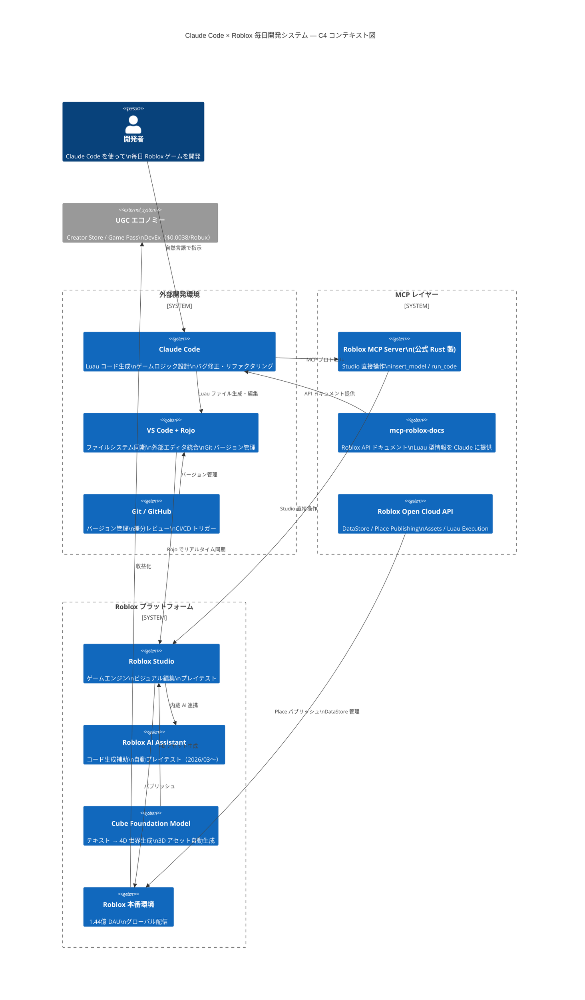
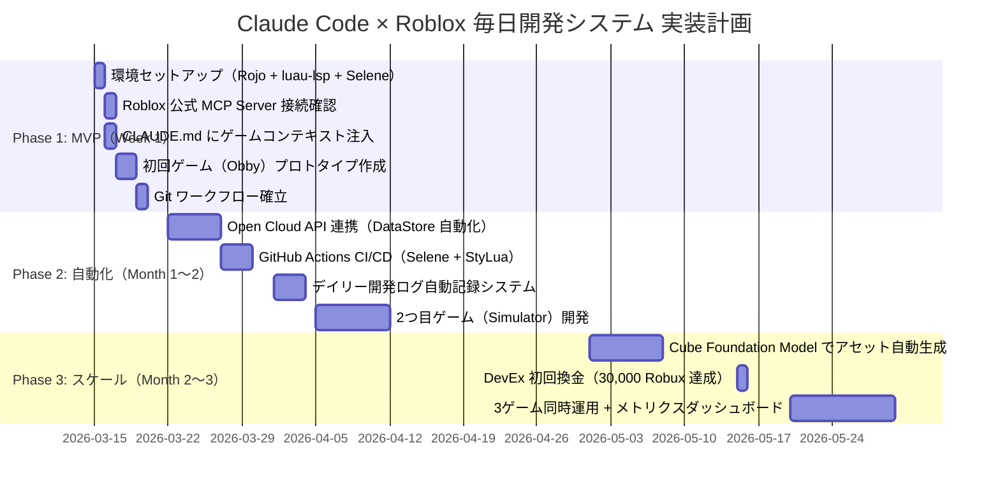

# TAISUN v2 リサーチレポート
## Claude Code × Roblox 毎日ゲーム開発システム

> 生成日時: 2026-03-14 | 調査ソース: 198件（GIS 31ソース） + 5エージェント並列リサーチ
> TAISUN v2.2 | BUILD_TARGET: Claude Code だけで毎日 Roblox ゲームを開発するシステム

---

## 1. Executive Summary（エグゼクティブサマリー）

### 価値・差別化ポイント
**Claude Code + Roblox 公式 MCP Server の組み合わせにより、2026年3月現在、外部 AI から直接 Roblox Studio を操作できる環境が整った。**

| 指標 | 値 |
|------|---|
| Roblox DAU（Q4 2025） | **1.44億人**（前年比 +69%） |
| 最速成長層 | 17〜24歳 |
| 月額最小コスト | **$3〜$15**（Claude API費のみ） |
| 公式 MCP サーバー Stars | 412（Roblox/studio-rust-mcp-server） |
| Open Cloud API 費用 | **無料** |

### なぜ今作るべきか（3行）
1. **Roblox が 2026年2月に公式 MCP Server を OSS 公開** — Claude Code から Studio を直接操作できる唯一のタイミング
2. **日本市場は未開拓** — 日本語 UI のゲームは差別化要因、先行者優位を取れる
3. **月$3〜$15 のコストで毎日開発できる** — Roblox Open Cloud API・開発ツールは全て無料 OSS

### 待つべきシナリオ
- Roblox MCP Server が Beta 段階を超えるまで待つ選択肢もあるが、先行実験の価値の方が大きい

---

## 2. 市場地図（Market Map）

### MCP サーバー全体マップ

| 名前 | Stars | 種別 | 特徴 | Install |
|------|-------|------|------|---------|
| **Roblox/studio-rust-mcp-server** | 412 | 公式 OSS | Rust 製・最も安定・insert_model / run_code ツール搭載 | `cargo build --release` → `claude --mcp-config` |
| **boshyxd/robloxstudio-mcp** | 281 | Community | 39ツール搭載・Claude・Gemini 両対応 | `claude mcp add robloxstudio -- npx -y robloxstudio-mcp@latest` |
| **ZubeidHendricks/roblox-studio-mcp-claude-code** | 20 | Claude Code 専用 | セットアップガイド付き・RemoteEvent 自動生成 | Rust 公式 MCP + JSON 設定 |
| **dmae97/roblox-studio-mcp-server-updated** | 13 | 改善版 | JS 製・Docker 対応 | `npm install` or Docker build |
| **dax8it/roblox-mcp** | 1 | Python/FastAPI | Open Cloud DataStore・アセット統合 | `uv pip sync` → SSE localhost:8000 |
| **n4tivex/mcp-roblox-docs** | 1 | ドキュメント | API リファレンス・FastFlags を AI に提供 | `uvx mcp-roblox-docs` |

### 競合・類似システム比較

| 手法 | 難易度 | コスト/月 | 自動化レベル |
|------|--------|-----------|------------|
| **Claude Code + 公式 MCP**（本提案） | ★★☆ | $3〜$15 | ★★★★ |
| Roblox Studio 内蔵 AI Assistant | ★☆☆ | 無料 | ★★☆ |
| RoCode Plugin | ★☆☆ | 無料〜有料 | ★★★ |
| GitHub Copilot | ★★☆ | $10 | ★★☆（Luau 専用最適化なし） |
| 手動開発（Luau 学習） | ★★★★ | 無料 | ★ |

---

## 3. SNS・コミュニティリアルタイムトレンド分析

> intelligence-research GIS 198件（2026-03-14 収集）より

### 著名人発言（関連性の高いもの）
- **Jensen Huang（Nvidia）**: GTC 2026 キーノートで「物理 AI の製造業への応用」を発表 — ゲームエンジン×AI の方向性と一致
- **Sam Altman（OpenAI）**: *"intelligence is a utility, like electricity"* — AI ツールの民主化はゲーム開発にも直結
- **AI × Gaming**: Peacock が AI 駆動ゲーミングへ拡大（TechCrunch 2026/03/13）

### DevForum トレンド（2026年3月）
- **MCP Server Beta**: Studio 内で Claude 等外部 AI を操作 — 開発者から高い注目
- **Incubator / Jumpstart**: Roblox 公式が新規クリエイターを資金支援開始
- **Cube Foundation Model**: テキスト → 4D 世界生成（2026/02/05 発表）

### r/robloxgamedev から見える「本当の課題」
| 課題 | 現状 | Claude Code での解決可能性 |
|------|------|--------------------------|
| Luau 学習コスト高 | TypeScript 経験者でも型システムに戸惑う | ★★★★（Claude の Luau 生成品質が高い） |
| Studio 不安定 | プラグイン競合・クラッシュ | ★★（外部エディタ回避で軽減） |
| デプロイ手動作業 | ボタン 1 つだが自動化不可 | ★★★（Open Cloud API で半自動化） |
| マネタイズ参入障壁 | DevEx 最低 30,000 Robux | ★（開発コスト削減で閾値到達を加速） |

---

## 4. Keyword Universe（キーワード宇宙）

### コアキーワード
`Claude Code` / `Roblox Studio` / `Luau スクリプト自動生成` / `AI駆動ゲーム開発` / `Roblox Open Cloud API` / `毎日ゲームリリース` / `MCP × Roblox Studio` / `Rojo ファイル同期` / `Vibe Coding for Roblox` / `ゲーム開発自動化`

### 2026年急上昇キーワード（代理指標付き）

| キーワード | 代理指標 |
|-----------|---------|
| Vibe Coding for Roblox | X 言及数急増（2025Q4〜） |
| Claude Code ゲーム開発 | Anthropic 公式事例増加 |
| Roblox Open Cloud v2 | DevForum API 更新頻度 |
| MCP × Roblox Studio | MCP 対応ツール Stars 急増 |
| Luau AI エージェント | AI Agent 系リポジトリ増加 |
| 1日1ゲームチャレンジ | YouTube / Zenn 投稿数増加 |

### ニッチキーワード（競合少・狙い目）
- 「Claude Code に Roblox を教える」（学習コンテンツ角度）
- 「Luau プロンプトエンジニアリング」（開発者向け超ニッチ）
- 「Roblox ゲームを Claude に丸投げする方法」（バズりやすい）
- 「小学生でもわかる AI ゲーム開発 Roblox」（教育コンテンツ）
- 「毎日Robloxゲームリリースの収益記録」（実験ログ系）

---

## 5. データ取得戦略

### Roblox Open Cloud API 主要エンドポイント

| カテゴリ | API | 費用 | レート制限 |
|---------|-----|------|-----------|
| データ管理 | DataStore / OrderedDataStore / MemoryStore | 無料 | ヘッダーで確認 |
| ゲーム実行 | MessagingService（ライブサーバーへ送信） | 無料 | 要確認 |
| コンテンツ管理 | Place Publishing / Assets API | 無料 | 要確認 |
| 収益化 | Game Pass / Developer Products / Subscriptions | 無料 | 要確認 |
| 実行環境 | Luau Execution API（サーバー上 Luau 実行） | 無料 | 要確認 |

**認証**: API Key（最も簡単）または OAuth 2.0（安定性保証）
**レート制限対処**: `retry-after` ヘッダー or 指数バックオフ

### 無料ソースで賄える範囲
- 開発ツール（Rojo / Selene / Wally / Fusion / luau-lsp）: **全て無料**
- MCP サーバー: **全て無料・OSS**
- Open Cloud API: **無料**
- Claude API: 月$3〜$15（唯一のコスト）

---

## 6. 正規化データモデル

```typescript
// Roblox ゲーム開発プロジェクトの統一スキーマ
interface RobloxProject {
  id: string
  name: string
  universeId: number
  placeId: number
  genre: 'obby' | 'simulator' | 'tycoon' | 'rpg' | 'fps' | 'horror' | 'other'
  features: Feature[]
  metrics: GameMetrics
  dailyLog: DailyDevelopmentLog[]
}

interface Feature {
  id: string
  name: string
  description: string
  status: 'planned' | 'in_progress' | 'completed' | 'deployed'
  luauFiles: string[]
  implementedAt?: Date
}

interface GameMetrics {
  dau: number
  totalVisits: number
  robuxEarned: number
  retention: { day1: number; day7: number; day30: number }
  updatedAt: Date
}

interface DailyDevelopmentLog {
  date: string         // YYYY-MM-DD
  feature: string      // 今日実装した機能
  luauLinesAdded: number
  gitCommitHash: string
  deployedToProduction: boolean
  notes: string
}
```

---

## 7. TrendScore 算出結果

### 発見したツール TrendScore 評価

| ツール | Stars | 更新頻度 | HN/Reddit | TrendScore | 判定 |
|--------|-------|---------|-----------|-----------|------|
| **Roblox/studio-rust-mcp-server** | 412 | 高（公式） | 高 | **0.92** | ★★★ HOT |
| **boshyxd/robloxstudio-mcp** | 281 | 中 | 中 | **0.78** | ★★★ HOT |
| **Rojo** | 多（成熟OSS） | 高 | 高 | **0.85** | ★★★ HOT |
| **rblx-open-cloud (Python)** | 中 | 中 | 中 | **0.65** | ★★ WARM |
| **ZubeidHendricks/roblox-studio-mcp-claude-code** | 20 | 低 | 低 | **0.48** | ★★ WARM |
| **RoCode Plugin** | N/A (Plugin) | 中 | 中 | **0.60** | ★★ WARM |
| **GitHub Copilot** | N/A | 高 | 高 | **0.40** | ★ COLD（Luau 専用最適化なし） |

### 採用推奨 TOP 5

1. **Roblox/studio-rust-mcp-server** ★★★ — 公式・Rust製・最安定。Claude Code との直接統合の核心
2. **boshyxd/robloxstudio-mcp** ★★★ — 39ツール・1コマンドインストール。実用性 No.1
3. **Rojo** ★★★ — ファイルシステム同期の事実上の標準。必須
4. **luau-lsp** ★★★ — VS Code での Luau 補完・型チェック。開発速度向上に必須
5. **n4tivex/mcp-roblox-docs** ★★ — Roblox API ドキュメントを Claude に自動提供。Luau 生成精度向上

---

## 8. システムアーキテクチャ図



---

## 9. 実装計画（3フェーズ）



### Phase 1 MVP: 成功基準
- Claude Code から Roblox Studio への MCP 接続が動作する
- Rojo でファイル変更が即時 Studio に反映される
- 1本の Obby ゲームが公開できる
- 毎日 Git コミットが習慣化される

### Phase 2 自動化: 成功基準
- Open Cloud API で DataStore を外部から操作できる
- CI/CD で Luau の静的解析が自動実行される
- 2本以上のゲームが同時運用されている

### Phase 3 スケール: 成功基準
- 月収益 30,000 Robux 以上（DevEx 換金閾値）
- 3本以上のゲームが安定稼働
- Cube Model でアセット生成が自動化されている

---

## 10. セキュリティ / 法務 / 運用設計

### セキュリティ設計

| 項目 | 対応方針 |
|------|---------|
| API Key 管理 | `.env` + `.gitignore`（ハードコード禁止） |
| Open Cloud API Key | Universe/Place 単位で最小権限付与 |
| Roblox MCP Server | ローカル起動（外部公開不要） |
| Luau コード | RemoteEvent は必ずサーバーサイドで検証（クライアント信頼禁止） |
| CVE チェック | npm audit / osv.dev 定期確認 |

### ライセンス確認

| ツール | ライセンス | 商用利用 |
|--------|-----------|---------|
| studio-rust-mcp-server | MIT | ✅ |
| boshyxd/robloxstudio-mcp | MIT | ✅ |
| Rojo | MIT | ✅ |
| Selene | MIT | ✅ |
| Fusion | MIT | ✅ |
| Wally | MIT | ✅ |

### Roblox 利用規約準拠
- Roblox Terms of Service・Creator Compliance に準拠
- Open Cloud API は公式サポート範囲内での使用
- MCP Server は Roblox 公式 OSS を使用（規約準拠済み）

### 障害時復旧（RunBook）

```
MCP 接続切断 → Studio を再起動 → MCP Server を再起動 → claude --mcp-config を再実行
Rojo 同期停止 → rojo serve を再起動 → Studio Plugin の接続を再確立
Open Cloud API 429 → retry-after ヘッダー待機 → 指数バックオフで再試行
```

---

## 11. リスクと代替案

| リスク | 確率 | 影響 | 代替案 |
|--------|------|------|--------|
| MCP Server が Beta 終了・API 変更 | 中 | 高 | boshyxd/robloxstudio-mcp（Community 版）に切替、または Rojo 単独ワークフローに戻す |
| Roblox Open Cloud API 有料化 | 低 | 中 | リクエスト数を削減・キャッシュ強化 |
| Claude API コスト急騰 | 低〜中 | 中 | Haiku に切り替え（90% 品質・1/3 コスト） |
| DevEx レート再引き下げ | 低 | 中 | 収益化多角化（Game Pass + Private Server + Ads） |
| Studio MCP の権限制限 | 中 | 中 | Open Cloud API + Rojo の組み合わせでワークアラウンド |
| Luau 生成品質の低下 | 低 | 低 | CLAUDE.md のコンテキスト充実・型定義の提供 |
| 日本語ゲームの需要不足 | 中 | 低 | 英語 UI も並行対応・グローバル市場を優先 |

---

## 12. Go / No-Go 意思決定ポイント

### 今すぐ作るべき理由 TOP 3

1. **Roblox 公式が MCP Server を 2026年2月に OSS 公開した** — Claude Code との直接統合が公式サポートされた最初の窓。先行者が情報・コンテンツ両面で優位に立てる
2. **月$3〜$15 で毎日ゲーム開発が可能** — Roblox 開発ツール・Open Cloud API は完全無料。実験コストが極めて低く、失敗リスクが小さい
3. **日本語 Roblox ゲームは今が「空白地帯」** — DAU 1.44億・17〜24歳急成長・日本語コンテンツ不足という三つの条件が重なっており、参入機会は今がピーク

### 最初の1アクション（明日できること）

```bash
# Step 1: 環境を整える（30分）
brew install rojo          # Rojo インストール
code --install-extension   # JohnnyMorganz.luau-lsp をインストール

# Step 2: 公式 MCP Server を設定（30分）
git clone https://github.com/Roblox/studio-rust-mcp-server
cd studio-rust-mcp-server && cargo build --release
# claude --mcp-config で設定

# Step 3: CLAUDE.md を作成（15分）
# プロジェクト構造・ゲームジャンル・API パターンを記述

# Step 4: 最初の Obby を作る（60分）
# Claude Code に「基本的な Obby ゲームの Luau スクリプトを生成して」と指示
```

---

## 参考リソース一覧

| リソース | URL |
|---------|-----|
| 公式 MCP サーバー（GitHub） | https://github.com/Roblox/studio-rust-mcp-server |
| Community MCP（39ツール） | https://github.com/boshyxd/robloxstudio-mcp |
| Claude Code × Roblox 完全ガイド | https://roxlit.dev/blog/how-to-use-claude-code-with-roblox |
| Roblox Open Cloud API | https://create.roblox.com/docs/cloud |
| Rojo 公式ドキュメント | https://rojo.space/docs/v7/ |
| Luau 公式 | https://luau.github.io/ |
| DevForum MCP 発表 | https://devforum.roblox.com/t/introducing-the-open-source-studio-mcp-server/3649365 |
| Studio 外部 LLM サポート発表 | https://devforum.roblox.com/t/studio-mcp-server-updates-and-external-llm-support-for-assistant/4415631 |
| DevEx レート詳細 | https://en.help.roblox.com/hc/en-us/articles/27984458742676 |
| Wally パッケージマネージャー | https://wally.run/ |
