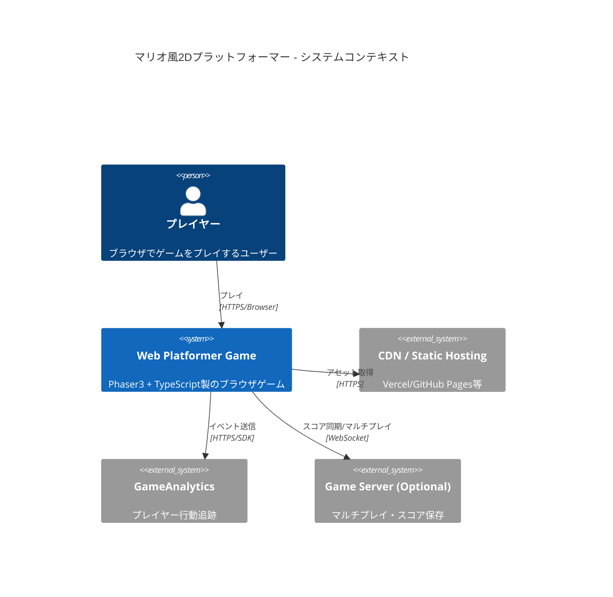
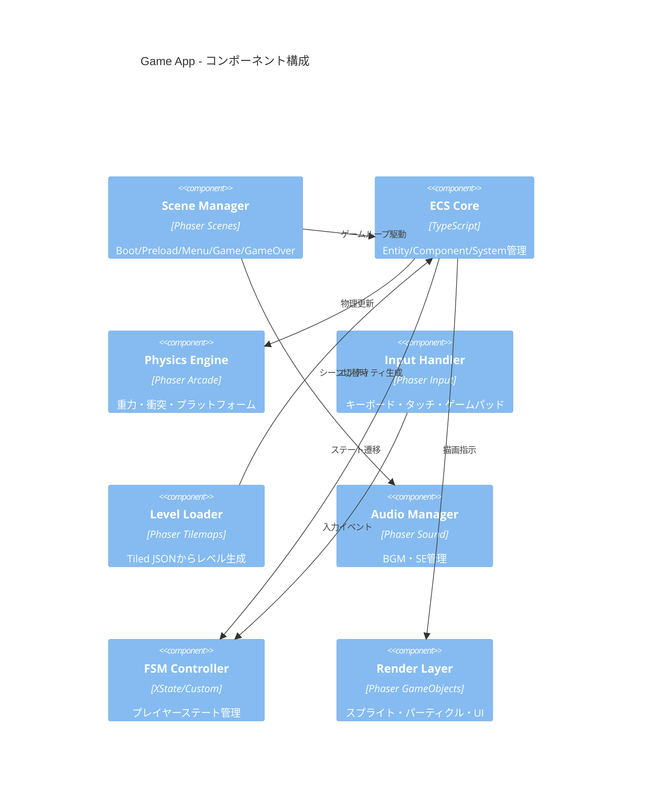
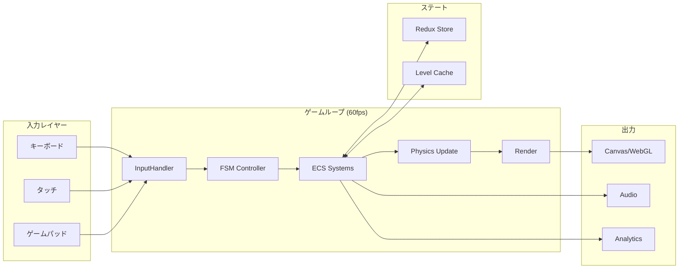
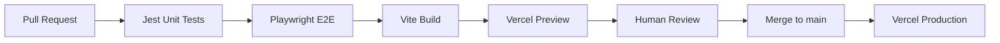

# Agent C — アーキテクチャ・最新トレンド・コミュニティ調査レポート

**BUILD_TARGET**: マリオ風2Dプラットフォーマーゲーム（ブラウザ/Web版）
**調査日**: 2026-03-20
**担当**: Agent C（アーキテクチャ・最新トレンド・コミュニティ調査）

---

## 1. 2026年時点のベストプラクティス・アーキテクチャパターン

### 1.1 ECS（Entity Component System）パターン

2026年時点で2Dプラットフォーマー開発における最も支持されるアーキテクチャはECSである。

**コアコンセプト**
- Entity: 一意IDのみを持つ薄いコンテナ
- Component: 純粋なデータ（位置・速度・重力・スプライトなど）
- System: コンポーネントを横断して処理する純粋なロジック

**プラットフォーマー向けの実装例**
```
PhysicsSystem     → Gravity + Transform をクエリ → 速度・位置を更新
CollisionSystem   → Collider + Transform をクエリ → 衝突判定
RenderSystem      → Sprite + Transform をクエリ → 描画
InputSystem       → Input + Player をクエリ → 入力処理
```

**ECS採用の利点**（出典: [PulseGeek - ECS Architecture in Game Development](https://pulsegeek.com/articles/ecs-architecture-in-game-development-core-patterns/)）
- 継承ツリーではなくコンポジションによる柔軟な設計
- データ局所性によるCPUキャッシュ効率の向上
- 機能追加・削除がコンポーネントの付け外しで完結

**参考実装**
- [Writing a 2D platformer using ECS - Sander Ledegen](https://sanderl.be/posts/2d-platformer-ecs/)
- [ECS 2D Action Platformer - Simeon Radivoev](https://simeonradivoev.com/blog/post/ecs-2d-action-platformer/)

### 1.2 ゲームステート管理: 有限状態機械（FSM）

**プレイヤーキャラクターのステート例**
```
idle → walk → run → jump → fall → land → idle
```

**Phaser3 + Redux パターン**（出典: [Zenn - Phaser3 + Redux + TypeScript](https://zenn.dev/btc/articles/250526_redux_phaser3)）
- 複数シーン間でスコア・ゲームデータを共有
- Redux Toolkit による不変データ管理
- 2025年以降の標準的なアプローチとして定着

**FSM実装の参考**
- [Game Programming Patterns - State](https://gameprogrammingpatterns.com/state.html)
- FSM + Pub-Sub の組み合わせで宣言的なゲームロジックを実現

### 1.3 レンダリングパイプライン: WebGPU への移行期

**2025-2026年のトレンド**
| 技術 | 状況 |
|------|------|
| Canvas 2D | 小規模ゲームに適切、手軽だが限界あり |
| WebGL | 現在の標準、Phaser3が使用 |
| WebGPU | プロダクション対応済み、Phaser4が採用予定 |

- Phaser 4 は2025年末リリース予定で、フルTypeScript・WebGPU対応・バンドルサイズ最小化を目指す（出典: [LogRocket - Best JavaScript and HTML5 game engines 2025](https://blog.logrocket.com/best-javascript-html5-game-engines-2025/)）
- WebGL vs Canvas のベンチマーク比較: [js-game-rendering-benchmark](https://github.com/Shirajuki/js-game-rendering-benchmark)

### 1.4 タイルマップ最適化

- 大型タイルマップは「セクション分割→オフスクリーンcanvas事前レンダリング→大きなタイルとして扱う」手法が有効（出典: [MDN - Tilemaps overview](https://developer.mozilla.org/en-US/docs/Games/Techniques/Tilemaps)）
- Tiled Map Editor + Phaser3 の組み合わせが2026年時点でデファクトスタンダード（[Zenn - Phaser3 TileMapの基礎](https://zenn.dev/hiro256ex/articles/20250425_phaser3tilemap)）

---

## 2. HN/Zenn コミュニティから読み取れる課題と未解決ニーズ

### 2.1 Hacker News の議論傾向

- JS→C移植の実験（[HN - Porting my JS game engine to C](https://news.ycombinator.com/item?id=41154135)）: パフォーマンス限界に挑戦する声
- Web Game Engines & Libraries まとめ（[HN #40129276](https://news.ycombinator.com/item?id=40129276), Apr 2024）: エンジン選定の複雑さへの不満
- Fluorite（Flutter統合ゲームエンジン, 2026）: クロスプラットフォーム需要の高まり

**未解決ニーズ**
- 軽量でバンドルサイズが小さいエンジン（Phaser3は大きすぎるという声）
- TypeScript対応の充実
- WebGPU対応エンジンの本番利用可否

### 2.2 Zenn コミュニティの実態

- Phaser3を使った記事が継続的に増加（2024-2026年）
- **HUD シーン分離**への関心: 複数シーン管理の複雑さ（[Zenn - Phaser3でHUDを別シーンとして実装](https://zenn.dev/btc/articles/250421_phaser_hud_scene)）
- **Redux統合**への模索: ゲームロジックとUIの分離
- Arcade Physics Engine の物理挙動チューニングが課題

**コミュニティ上の頻出ハマりポイント**
1. コライダー設定とプラットフォーム通り抜け問題
2. アセット読み込みタイミングとシーン管理
3. モバイル対応（タッチ入力 + レスポンシブ）
4. TypeScript + Phaser3 の型定義の整備

---

## 3. 類似OSSプロジェクトの比較

### 3.1 主要2Dゲームフレームワーク比較

| フレームワーク | GitHub Stars | 最終更新 | 特徴 |
|--------------|-------------|---------|------|
| **Phaser 3** | ~37,000 | アクティブ（週次更新） | 最大のHTML5ゲームフレームワーク、豊富なドキュメント |
| **Kaboom.js / KAPLAY** | ~3,500 | アクティブ | シンプルAPI、教育向け、Phaserの軽量代替 |
| **melonJS** | ~5,700 | アクティブ | 軽量、Tiled連携強、HN紹介実績あり |
| **Excalibur.js** | ~1,600 | アクティブ | TypeScript-first、ECS採用 |
| **LittleJS** | ~3,200 | アクティブ | 超軽量(<5KB)、1人プロジェクト向け |
| **Pixi.js** | ~43,000 | アクティブ | レンダラー特化、WebGL/WebGPU対応 |

出典: [LogRocket - Best JavaScript and HTML5 game engines 2025](https://blog.logrocket.com/best-javascript-html5-game-engines-2025/), [Genieee - Top HTML5 Game Engines Compared](https://genieee.com/blogs/top-html5-game-engines-compared-choosing-the-right-engine-for-your-next-game/)

### 3.2 マリオ風プラットフォーマー向け推奨

**Phaser 3 + TypeScript + Redux** の組み合わせが最もエコシステムが成熟しており、2026年時点で第一選択。

```
理由:
- Arcade Physics でプラットフォームゲーム物理が容易
- Tiled連携でレベルデザインが効率的
- 豊富な日本語ドキュメント（Zenn/Qiita）
- Phaser4移行パスが明確
```

---

## 4. Mermaid C4 アーキテクチャ図

### 4.1 システムコンテキスト図（C4 Level 1）



### 4.2 コンテナ図（C4 Level 2）

```mermaid
C4Container
    title マリオ風2Dプラットフォーマー - コンテナ構成

    Person(player, "プレイヤー")

    Container_Boundary(browser, "ブラウザ") {
        Container(gameApp, "Game App", "TypeScript/Phaser3", "ゲームロジック・レンダリング")
        Container(stateStore, "State Store", "Redux Toolkit", "ゲームステート管理")
        Container(assetLoader, "Asset Loader", "Phaser Loader", "スプライト・音声・タイルマップ")
    }

    Container_Ext(staticHost, "Static Host", "Vercel/GitHub Pages", "HTML/JS/アセット配信")
    Container_Ext(analyticsSDK, "Analytics SDK", "GameAnalytics", "KPIトラッキング")
    Container_Ext(wsServer, "WS Server (Optional)", "Node.js/Colyseus", "リアルタイム同期")

    Rel(player, gameApp, "操作", "キーボード/タッチ")
    Rel(gameApp, stateStore, "状態読み書き")
    Rel(gameApp, assetLoader, "アセット要求")
    Rel(gameApp, analyticsSDK, "イベント")
    Rel(gameApp, wsServer, "WebSocket")
    Rel(staticHost, browser, "配信", "HTTPS")
```

### 4.3 コンポーネント図（C4 Level 3 - Game App内部）



### 4.4 データフロー図



---

## 5. セキュリティ・スケーラビリティ・コストのトレードオフ

### 5.1 セキュリティ

| リスク | 脅威 | 対策 |
|--------|------|------|
| チート・スコア改ざん | クライアント側での得点操作 | **サーバーサイド検証**（オーソリタティブサーバー） |
| XSS | 外部レベルデータのインジェクション | 入力サニタイズ、CSP設定 |
| アセット盗用 | スプライト・音声の無断利用 | ライセンス管理、難読化（限定的） |
| DDoS（マルチプレイ時） | WebSocketサーバーへの攻撃 | レートリミット、Cloudflare等 |

**原則**（出典: [Dataconomy - Multiplayer Browser Game Guide](https://dataconomy.com/2025/11/04/step-by-step-guide-building-a-multiplayer-browser-game-using-node-js/)）
- クライアント入力は**絶対に信頼しない**
- サーバーがゲーム状態の唯一の真実（Single Source of Truth）
- P2P（WebRTC）はホスト権限の問題があるため競技性の高いゲームには不向き

### 5.2 スケーラビリティ

**シングルプレイヤー（静的ホスティング）**
```
構成: GitHub Pages / Vercel（無料枠）
スケール: CDNキャッシュで事実上無制限
コスト: 月額 $0〜$20
```

**マルチプレイヤー（WebSocket + Colyseus）**
```
構成: Node.js + Colyseus + Redis Pub/Sub
スケール: Redis でルーム状態を複数サーバー間同期
コスト: Railway/Fly.io で月額 $5〜$50（同時接続数次第）
```

**スケールアップ戦略**
- ルーム単位のステートレス設計 → 水平スケール可能
- Redis pub/sub でルームをサーバー間に分散
- Socket.IOネームスペースでゲームタイプ別に分離

出典: [Colyseus - Real-Time Multiplayer Framework](https://colyseus.io/)

### 5.3 コストトレードオフ

| フェーズ | 構成 | 月額コスト | 備考 |
|----------|------|-----------|------|
| プロトタイプ | 静的のみ (GitHub Pages) | $0 | シングルプレイのみ |
| MVP | Vercel + GameAnalytics Free | $0〜$20 | アナリティクス込み |
| 成長期 | Vercel + Colyseus (Railway) | $20〜$100 | マルチプレイ追加 |
| スケール期 | AWS/GCP + Redis + CDN | $100〜 | 1,000人同時接続超 |

### 5.4 CI/CD パイプライン

**推奨構成**（出典: [Playgama - CI/CD for Gaming Projects 2025](https://playgama.com/blog/general/effective-ci-cd-implementation-for-gaming-project-success/)）



- **CI ツール**: GitHub Actions（無料枠で十分）
- **テスト**: Jest（ユニット）+ Playwright（E2E）
- **ビルド**: Vite（HMR対応、高速バンドル）
- **デプロイ**: Vercel（自動プレビュー）or GitHub Pages

### 5.5 アナリティクス統合

**推奨ツール**（出典: [GameAnalytics](https://www.gameanalytics.com/), [Mitzu - Top 5 Gaming Analytics 2026](https://www.mitzu.io/post/top-5-gaming-analytics-tools-to-use)）

| ツール | 特徴 | 無料枠 |
|--------|------|--------|
| GameAnalytics | ゲーム特化、レベル進行・リテンション | 無制限（小規模） |
| Firebase | Google統合、リアルタイムDB連携 | 寛大な無料枠 |
| Mixpanel | イベント分析に強い | 月10万イベント |

**追跡すべき主要KPI**
- DAU/MAU（日次・月次アクティブユーザー）
- セッション長・頻度
- レベル別完了率・離脱率
- Day 1/7/30 リテンション率

---

## 6. 未解決ニーズ・追加調査事項

### 6.1 未解決ニーズ

1. **Phaser 4 の正式リリース時期**: 2025年末予定とされるが、2026年3月時点で未リリース。移行コストと互換性が不明
2. **WebGPU の本番安全性**: Safari サポートが限定的、iOS での動作保証が課題
3. **マルチプレイのラグ補正**: ロールバック方式 vs 予測補間の最適解
4. **モバイルUX**: タッチ仮想スティックの快適な実装パターン

### 6.2 追加調査推奨テーマ

- Phaser 4 Alpha のベンチマーク比較（Phaser 3 vs 4 パフォーマンス）
- XState v5 と Phaser3 の統合パターン
- Vite + Phaser3 の最小構成テンプレート
- LLM支援のプロシージャルレベル生成（2026年新興トレンド）

---

## 出典一覧

- [ECS Architecture in Game Development - PulseGeek](https://pulsegeek.com/articles/ecs-architecture-in-game-development-core-patterns/)
- [Writing a 2D platformer using ECS - Sander Ledegen](https://sanderl.be/posts/2d-platformer-ecs/)
- [ECS 2D Action Platformer - Simeon Radivoev](https://simeonradivoev.com/blog/post/ecs-2d-action-platformer/)
- [Game Programming Patterns - State](https://gameprogrammingpatterns.com/state.html)
- [Zenn - Phaser3 + Redux + TypeScript](https://zenn.dev/btc/articles/250526_redux_phaser3)
- [Zenn - Phaser3 TileMapの基礎](https://zenn.dev/hiro256ex/articles/20250425_phaser3tilemap)
- [Zenn - Phaser3でHUDを別シーンとして実装](https://zenn.dev/btc/articles/250421_phaser_hud_scene)
- [MDN - Tiles and tilemaps overview](https://developer.mozilla.org/en-US/docs/Games/Techniques/Tilemaps)
- [LogRocket - Best JavaScript and HTML5 game engines 2025](https://blog.logrocket.com/best-javascript-html5-game-engines-2025/)
- [Phaser - Official Site](https://phaser.io/)
- [js-game-rendering-benchmark - GitHub](https://github.com/Shirajuki/js-game-rendering-benchmark)
- [Colyseus - Real-Time Multiplayer Framework](https://colyseus.io/)
- [Dataconomy - Multiplayer Browser Game Guide](https://dataconomy.com/2025/11/04/step-by-step-guide-building-a-multiplayer-browser-game-using-node-js/)
- [P2P Multiplayer without Server - Medium](https://medium.com/@aguiran/building-real-time-p2p-multiplayer-games-in-the-browser-why-i-eliminated-the-server-d9f4ea7d4099)
- [Playgama - CI/CD for Gaming Projects 2025](https://playgama.com/blog/general/effective-ci-cd-implementation-for-gaming-project-success/)
- [GameCI](https://game.ci/)
- [GameAnalytics](https://www.gameanalytics.com/)
- [Mitzu - Top 5 Gaming Analytics Tools 2026](https://www.mitzu.io/post/top-5-gaming-analytics-tools-to-use)
- [Gamedeveloper - Procedural Platformer Levels](https://www.gamedeveloper.com/design/how-to-make-insane-procedural-platformer-levels)
- [Gamedeveloper - Level Design Patterns in 2D Games](https://www.gamedeveloper.com/design/level-design-patterns-in-2d-games)
