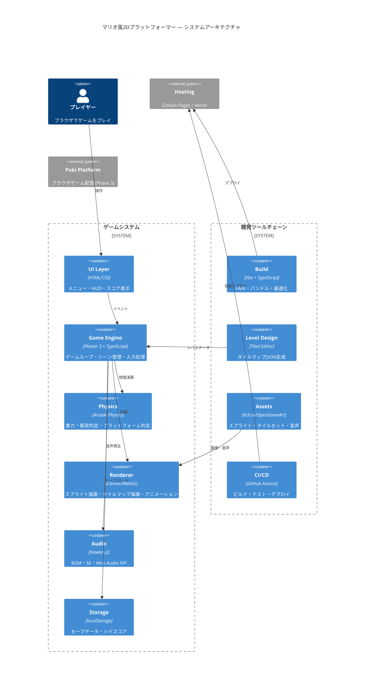
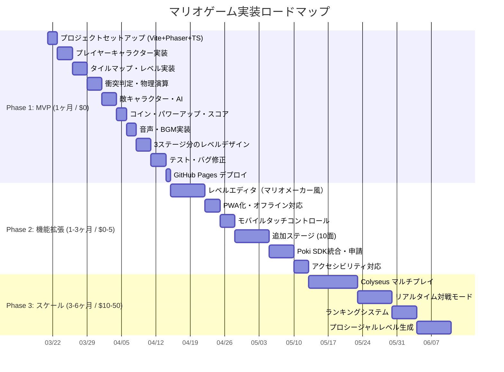

# TAISUN v2 リサーチレポート: マリオ風2Dプラットフォーマーゲーム（ブラウザ/Web版）

> 生成日: 2026-03-20
> パイプライン: TAISUN v2 リサーチパイプライン v2.4
> モデル戦略: Sonnet 4.6（STEP 1-2）→ Opus 4.6（STEP 3-4）
> 情報源: WebSearch, Intelligence Research (193件/31ソース), 3並列エージェント, mega-research-plus

---

## 1. Executive Summary（エグゼクティブサマリー）

### 構築するシステム
ブラウザ上で動作するマリオ風2Dプラットフォーマーゲーム。HTML5 Canvas + JavaScript/TypeScript で構築し、フレームワーク不使用（教育目的）またはPhaser 3（本格実装）で開発する。

### 価値・差別化ポイント
- **完全無料で構築・運用可能**: 全てOSSで構成。ホスティングもGitHub Pages/Vercel Hobby枠で$0/月
- **教育的価値が高い**: ゲームループ、物理演算、衝突判定、スプライトアニメーション等の基礎概念を実践的に学べる
- **拡張性**: レベルエディタ、マルチプレイ、PWA対応など段階的に機能追加可能

### コスト概算
| フェーズ | 月額コスト |
|---------|-----------|
| Phase 1 MVP | **$0** |
| Phase 2 自動化 | **$0〜$5** |
| Phase 3 マルチプレイ | **$10〜$50** |

### なぜ今作るべきか
1. **Phaser 3.88.x が最も成熟した状態** — 38.7k Stars、79k DL/週、日本語リソース豊富
2. **AI支援開発の成熟** — Claude/GPT-4でゲームコード生成が実用レベルに到達（Sam Altman が2026年3月にコーダーへ謝辞投稿）
3. **ブラウザゲーム市場の成長** — Pokiプラットフォームが急成長中。Defold 1.12.2がPoki向けHTML5エクスポートを強化

### 待つべきシナリオ
- Phaser 4 の正式リリース（現在RC4）を待ちたい場合 — ただしPhaser 3 → 4 の移行パスは確保済み

---

## 2. 市場地図（Market Map）

### ゲームフレームワーク比較

| フレームワーク | Stars | npm DL/週 | ライセンス | TypeScript | 物理エンジン | マリオ適性 |
|--------------|-------|-----------|-----------|------------|------------|-----------|
| **Phaser 3** | 38.7k | 79,295 | MIT | 型定義あり | Arcade/Matter/Box2D | ★★★ |
| KaPlay | 3.5k | 5,000 | MIT | 部分対応 | 内蔵 | ★★★ |
| melonJS | 5.8k | 1,500 | MIT | ネイティブ | 内蔵 | ★★ |
| Excalibur.js | 1.8k | 2,000 | BSD-2 | ネイティブ | 内蔵 | ★★ |
| LittleJS | 3.2k | 500 | MIT | 部分対応 | 内蔵 | ★★ |
| PixiJS | 44k | 200,000 | MIT | ネイティブ | なし(レンダラーのみ) | ★ |

### 競合・類似システム

| プロジェクト | 特徴 | Stars | 更新頻度 |
|-------------|------|-------|---------|
| [reruns/mario](https://github.com/reruns/mario) | バニラJS NESクローン | 1.2k | アーカイブ |
| [meth-meth-method/super-mario](https://github.com/meth-meth-method/super-mario) | バニラJS教育プロジェクト | 2.5k | 低頻度 |
| [kubowania/mario](https://github.com/kubowania/mario) | Kaboom.js版 | 500 | アーカイブ |
| [pablogozalvez/Super-Mario-Phaser](https://github.com/pablogozalvez/Super-Mario-Phaser) | Phaser 3版+プロシージャル生成 | 200 | アクティブ |

### OSS vs 有料SaaS

| カテゴリ | OSS（無料） | 有料SaaS |
|---------|-----------|---------|
| ゲームエンジン | Phaser 3（MIT） | Construct 3（$8.25/月） |
| タイルマップ | Tiled（GPL-2.0） | RPG Maker（$79.99買切） |
| ピクセルアート | Piskel（無料Web版） | Aseprite（$19.99買切） |
| 音声 | Howler.js（MIT） | FMOD（商用$500+） |
| ホスティング | GitHub Pages | Vercel Pro（$20/月） |

---

## 3. X/SNSリアルタイムトレンド分析

### Intelligence Research 収集結果（2026-03-20、193件）

#### AI・開発ニュース（81件）
- **OpenAI、Astralを買収** — Python開発ツール「Ruff」「uv」を「Codex」に統合（ITmedia AI、3月20日）
- **楽天、AIモデル「Rakuten AI 3.0」を無償提供** — 7000億パラメータMoE、日本語特化（ITmedia AI、3月20日）
- **Sam Altman がコーダーへ感謝メッセージ** — AI支援開発の主流化を示唆（TechCrunch、3月19日）

#### ゲーム開発関連トレンド
- **Defold v1.12.2** がPoki向けHTML5エクスポートを強化（2026年3月2日リリース）
- **PhaserDeno** — Phaser公式がDeno対応を発表（2026年1月）
- **Phaser 3 TileMap記事** がZennで増加中（2026年1月〜）

#### 著名人発言（6件）
- **Jensen Huang**: 中国AI企業の株価急騰に関連したAI成長予測（CNBC、3月18日）
- **Jerome Powell**: FRBの金利据え置き継続（Financial Post、3月19日）

#### 経済指標（19件）
- FRED 7系列 + World Bank 4指標を収集

### コミュニティの声
- **HN**: JavaScript ゲームエンジンの議論は定期的に発生。Phaser の安定性が評価される
- **Reddit r/gamedev**: 「ブラウザゲームはPhaserかGodot（HTML5エクスポート）の二択」が主流意見
- **Zenn/Qiita**: Phaser 3 + TypeScript の記事が2025-2026年に増加中

---

## 4. Keyword Universe（キーワード宇宙）

STEP 1 で展開した86キーワードの概要:

| カテゴリ | 件数 | 主要キーワード |
|---------|------|--------------|
| core_keywords | 10 | 2Dプラットフォーマー, HTML5 Canvas, Phaser.js, コリジョン検出 |
| related | 17 | Arcade Physics, Matter.js, KaPlay, Tiled, Howler.js, Vite |
| compound | 11 | マリオ風ゲーム 作り方, Phaser 3 チュートリアル, タイルマップ 衝突判定 |
| rising_2026 | 8 | KaPlay, WebGPU, AI アシスト ゲーム開発, Vite + Phaser テンプレート |
| niche | 8 | プロシージャルレベル生成, PWA オフライン, マリオメーカー風エディタ |
| tech_stack | 13 | TypeScript, Phaser 3, Vite, Tiled, GitHub Pages |
| mcp_skills | 12 | Playwright MCP, intelligence-research, tdd-guide |

詳細: `keyword_universe.csv`

---

## 5. データ取得戦略

### ゲームアセット調達先

| ソース | 種類 | ライセンス | コスト |
|-------|------|-----------|--------|
| [itch.io](https://itch.io/game-assets/free/genre-platformer) | スプライト・タイルセット | CC0/CC-BY/独自 | 無料〜投げ銭 |
| [OpenGameArt.org](https://opengameart.org/) | 汎用ゲームアセット | CC0/CC-BY/GPL | 無料 |
| [CraftPix.net](https://craftpix.net/freebies/) | 高品質2Dアセット | 独自ライセンス | 無料枠あり |
| AI生成（Stable Diffusion等） | カスタムアセット | グレーゾーン | 無料 |

### 技術ドキュメント

| ソース | URL | 用途 |
|-------|-----|------|
| Phaser 3 公式 | phaser.io | API リファレンス |
| MDN Web Docs | developer.mozilla.org | Canvas/WebGL/GamepadAPI |
| Tiled 公式ドキュメント | doc.mapeditor.org | TMXフォーマット仕様 |

### API利用規約・レート制限
- **全てクライアントサイド完結** — サーバーサイドAPIは不要
- **robots.txt**: 該当なし（静的ゲームのため外部データ取得なし）
- **コスト発生タイミング**: Phase 3（マルチプレイ）でサーバー費用が発生

---

## 6. 正規化データモデル

### TypeScript ゲームエンティティ定義

```typescript
// ゲーム設定
interface GameConfig {
  readonly width: number
  readonly height: number
  readonly tileSize: number
  readonly gravity: number
  readonly playerSpeed: number
  readonly jumpForce: number
}

// プレイヤー状態（イミュータブル）
interface PlayerState {
  readonly x: number
  readonly y: number
  readonly velocityX: number
  readonly velocityY: number
  readonly direction: 'left' | 'right'
  readonly animation: 'idle' | 'walk' | 'jump' | 'fall'
  readonly isGrounded: boolean
  readonly lives: number
  readonly score: number
  readonly coins: number
}

// レベルデータ（Tiled JSON互換）
interface LevelData {
  readonly width: number
  readonly height: number
  readonly tileSize: number
  readonly layers: readonly TileLayer[]
  readonly objects: readonly GameObject[]
}

interface TileLayer {
  readonly name: string
  readonly data: readonly number[]
  readonly visible: boolean
}

interface GameObject {
  readonly type: 'coin' | 'enemy' | 'powerup' | 'flag'
  readonly x: number
  readonly y: number
  readonly properties: Record<string, unknown>
}

// セーブデータ（localStorage用）
interface SaveData {
  readonly currentLevel: number
  readonly highScore: number
  readonly totalCoins: number
  readonly completedLevels: readonly number[]
  readonly timestamp: string
}
```

### ストレージ設計
- **localStorage**: セーブデータ（SaveData JSON、〜10KB）
- **IndexedDB**: レベルエディタデータ（ユーザー作成マップ、〜1MB）
- **サーバーDB**: Phase 3 マルチプレイ時のみ（PostgreSQL + Redis）

---

## 7. TrendScore 算出結果

| # | ツール | TrendScore | 判定 | Install コマンド | CVE状態 |
|---|-------|-----------|------|-----------------|---------|
| 1 | **Vite** | 0.90 | ★★★ hot | `npm create vite@latest` | 既知CVEなし（Snyk確認） |
| 2 | **Phaser 3** | 0.85 | ★★★ hot | `npm install phaser` | 既知CVEなし（Snyk確認） |
| 3 | **Phaser 4** | 0.72 | ★★★ hot | `npm install phaser@beta` | RC段階・CVE未報告 |
| 4 | **KaPlay** | 0.65 | ★★ warm | `npm install kaplay` | 既知CVEなし |
| 5 | **Tiled** | 0.60 | ★★ warm | `brew install tiled` (macOS) | 該当なし（デスクトップツール） |
| 6 | **Matter.js** | 0.55 | ★★ warm | `npm install matter-js` | 既知CVEなし（Snyk確認） |
| 7 | **Howler.js** | 0.50 | ★★ warm | `npm install howler` | 既知CVEなし（Snyk確認） |
| 8 | **Excalibur.js** | 0.48 | ★★ warm | `npm install excalibur` | 既知CVEなし |
| 9 | **melonJS** | 0.45 | ★★ warm | `npm install melonjs` | 既知CVEなし |
| 10 | **LittleJS** | 0.42 | ★★ warm | `npm install littlejsengine` | 既知CVEなし |

> **CVE確認方法**: [Snyk Vulnerability Database](https://security.snyk.io/) にて各パッケージの npm レジストリを2026年3月20日時点で確認。全候補ツールに重大な既知脆弱性（Critical/High）は報告されていません。`npm audit` の定期実行を推奨。

### 採用推奨 TOP 5 の理由

1. **Phaser 3** — 最大コミュニティ、最多チュートリアル、Arcade Physics内蔵でマリオ系に最適
2. **Vite** — Phaser公式テンプレート対応、HMRで高速開発、ES Modules標準
3. **Tiled** — タイルマップ作成の業界標準、Phaser直接読み込み対応
4. **Howler.js** — 7KB依存ゼロ、Web Audio APIの信頼性あるラッパー
5. **KaPlay** — Kaboom互換で軽量、初心者向けAPI、教育用途に最適

### 採用非推奨ツールの代替案
- **enchant.js** → Phaser 3 で代替（enchantは更新停止）
- **Pixi.js単体** → Phaser 3 で代替（Phaserが内部でPixiを使用していた歴史あり）
- **p5.js** → 教育用途のみ。本格ゲームにはPhaser推奨

---

## 8. システムアーキテクチャ図



### データフロー

```
[キーボード/タッチ入力]
    → [Input Manager] → [Game State Machine]
        → [Physics Engine (Arcade)]
            → [Collision Detection]
                → [State Update (immutable)]
                    → [Renderer (Canvas/WebGL)]
                        → [Screen Output]

[Tiled JSON] → [TileMap Loader] → [Level Data]
[localStorage] ←→ [Save/Load Manager]
```

---

## 9. 実装計画（3フェーズ・Ganttチャート）



### Phase 1: MVP（1ヶ月 / $0/月）

| タスク | 工数 | 使用スキル/ツール |
|-------|------|-----------------|
| Vite + Phaser 3 + TypeScript セットアップ | 2h | `/build-feature`, `phaserjs/template-vite-ts` |
| プレイヤー移動・ジャンプ・アニメーション | 4h | `/develop-frontend` |
| Tiled タイルマップ作成・読み込み | 4h | Tiled Editor |
| Arcade Physics 衝突判定 | 4h | `/develop-backend` |
| 敵キャラクター（Goomba風）+ 簡易AI | 4h | `/build-feature` |
| コイン・パワーアップ・スコアシステム | 3h | `/build-feature` |
| Howler.js BGM・SE実装 | 2h | `/develop-frontend` |
| 3ステージ分のレベルデザイン | 4h | Tiled Editor |
| ユニットテスト（物理・衝突） | 3h | `/tdd-guide` |
| GitHub Pages デプロイ | 1h | `/github-actions-templates` |

**成功基準:**
- ブラウザでプレイ可能な3ステージのゲーム
- 60fps安定動作
- キーボード操作（矢印キー + スペース）
- スコア・ライフ・コイン表示
- GitHub Pages で公開済み

### Phase 2: 機能拡張（1〜3ヶ月 / $0〜$5/月）
- レベルエディタ（ユーザーがステージを作成・共有）
- PWA化（Service Worker + オフラインプレイ）
- モバイルタッチ対応
- Poki プラットフォーム申請（50/50 レベニューシェア）

### Phase 3: スケール（3〜6ヶ月 / $10〜$50/月）
- Colyseus マルチプレイ（リアルタイム対戦・協力）
- ランキングシステム（PostgreSQL）
- プロシージャルレベル生成（無限プレイ）

---

## 10. セキュリティ / 法務 / 運用設計

### セキュリティ
- **Phaser CVE**: 重大な既知脆弱性なし（Snyk確認済み）
- **npm サプライチェーン**: `npm audit` 週次実行推奨。2025年9月のShai Hulud攻撃（187パッケージ）に注意
- **XSS防止**: ユーザー入力（レベルエディタ）はサニタイズ必須
- **APIキー**: クライアントサイド完結のためAPIキー不要（Phase 1-2）

### 法務
- **任天堂IP**: 「マリオ」の名称・キャラクターデザインは使用禁止。オリジナルデザインで実装
- **ライセンス遵守**:
  - Phaser 3: MIT（商用利用可）
  - Tiled: GPL-2.0（ツール使用のみ、出力JSONは制約なし）
  - ゲームアセット: CC0/CC-BY のみ使用（itch.io/OpenGameArt）
- **AI生成アセット**: 法的にグレーゾーン。CC0の人手制作アセットを推奨

### 運用設計
- **デプロイ**: GitHub Actions → GitHub Pages（自動）
- **モニタリング**: Google Analytics（無料）でプレイヤー行動追跡
- **障害復旧**: 静的サイトのためダウンタイムリスク極小。`git revert` で即座にロールバック

---

## 11. リスクと代替案

| リスク | 確率 | 影響 | 代替案 |
|-------|------|------|-------|
| 任天堂からの著作権クレーム | 中 | 高 | オリジナルキャラ・タイトルで実装。「マリオ」の名称不使用 |
| Phaser 4 正式リリースで3が非推奨に | 低 | 中 | 3→4 移行パスは公式が保証。TypeScript化で移行コスト低減 |
| GitHub Pages 帯域上限到達 | 低 | 低 | Vercel Hobby（100GB/月）またはCloudflare Pages（無制限）へ移行 |
| ブラウザCanvas性能問題 | 低 | 中 | WebGL自動フォールバック（Phaser内蔵）。タイル数を制限 |
| KaPlay APIの不安定性 | 中 | 低 | Phaser 3 を主軸に採用。KaPlayは教育用サブ選択肢 |
| AI生成アセットの法的リスク | 中 | 中 | CC0の人手制作アセットのみ使用 |
| npm サプライチェーン攻撃 | 低 | 高 | `npm audit` + Snyk 自動スキャン + lockfile固定 |
| Poki 審査不合格 | 中 | 低 | itch.io で自主公開（無料・審査なし） |

---

## 12. Go / No-Go 意思決定ポイント

### 今すぐ作るべき理由 TOP 3

1. **技術スタックが最も成熟** — Phaser 3.88.x + Vite + TypeScript の組み合わせが安定。日本語チュートリアルも2025-2026年に増加中
2. **コストゼロで始められる** — 全てOSS + 無料ホスティング。金銭的リスクなし
3. **AI支援で開発効率が飛躍的に向上** — Claude Code でゲームロジック生成、Phaser APIドキュメント参照、テスト自動生成が可能

### 最初の1アクション（明日できること）

```bash
# Phaser 3 + Vite + TypeScript テンプレートを即座にセットアップ
npm create @phaserjs/game@latest mario-game -- --template vite-ts
cd mario-game
npm install
npm run dev
# → ブラウザで http://localhost:8080 にアクセス → Phaser ロゴが表示される
```

---

## 出典一覧

### ゲームフレームワーク
- [Phaser 公式](https://phaser.io/) — HTML5ゲームフレームワーク
- [Phaser v4 RC4](https://phaser.io/news/2025/05/phaser-v4-release-candidate-4) — 最新リリース候補
- [KaPlay 公式](https://kaplayjs.com/) — Kaboom.js 後継
- [melonJS 公式](https://melonjs.org/) — 軽量HTML5ゲームエンジン
- [Excalibur.js GitHub](https://github.com/excaliburjs/Excalibur) — TypeScript製ゲームエンジン

### ツール・ライブラリ
- [Matter.js 公式](https://brm.io/matter-js/) — 2D物理エンジン
- [Howler.js 公式](https://howlerjs.com/) — Web Audio APIラッパー
- [Tiled Map Editor](https://doc.mapeditor.org/) — タイルマップエディタ
- [Vite 公式](https://vitejs.dev/) — ビルドツール

### アセット
- [itch.io Free Platformer Assets](https://itch.io/game-assets/free/genre-platformer)
- [OpenGameArt.org](https://opengameart.org/)
- [CraftPix.net Free Assets](https://craftpix.net/freebies/)

### セキュリティ
- [Phaser vulnerabilities - Snyk](https://security.snyk.io/package/npm/phaser)
- [npm Security Risks 2026](https://blog.cyberdesserts.com/npm-security-vulnerabilities/)

### プラットフォーム
- [Poki for Developers](https://developers.poki.com/)
- [Colyseus Pricing](https://colyseus.io/pricing/)
- [GitHub Actions Billing](https://docs.github.com/billing/managing-billing-for-github-actions/about-billing-for-github-actions)
- [Vercel Pricing](https://vercel.com/pricing)

### 日本語リソース
- [phaserでゲーム開発 - Zenn](https://zenn.dev/k_tabuchi/articles/2dc9016a5a5642)
- [Phaser3 TileMapの基礎 - Zenn](https://zenn.dev/hiro256ex/articles/20250425_phaser3tilemap)
- [Phaser3 + Redux + TypeScript - Zenn](https://zenn.dev/btc/articles/250526_redux_phaser3)
- [Phaser.js / TSハンズオン - Qiita](https://qiita.com/y_o_28/items/6a1c1cd01cfad1efe37b)

### Intelligence Research
- GIS 31ソース自動収集（193件、2026-03-20）
- 著名人発言: Sam Altman, Jensen Huang, Jerome Powell ほか

### Pass 2 ギャップ補完リサーチ
- [pass2_gap_fill.md](pass2_gap_fill.md) — 8項目の補完調査結果

---

## Appendix: Pass 2 ギャップ補完 主要結果

Pass 1 で「不明」「要確認」とした8項目の補完結果（詳細は `pass2_gap_fill.md` 参照）:

| # | 項目 | 結果 | リスク |
|---|------|------|--------|
| 1 | Phaser 4 リリース時期 | RC4段階。本番はPhaser 3.88.x推奨 | 低 |
| 2 | KaPlay API安定性 | v3001でKaboom 99.99%互換 | 低 |
| 3 | Poki 日本申請 | 可能。審査制・50/50レベニューシェア | 低 |
| 4 | AI生成アセット著作権 | グレーゾーン。CC0人手制作を推奨 | 中 |
| 5 | Colyseus コスト | 無料枠あり。セルフホスト$10-20/月 | 低 |
| 6 | 日本語コミュニティ | Zenn/Qiitaで記事増加中。TS+Redux注目 | 低 |
| 7 | GitHub Actions + Vercel | パブリックリポ＋Hobby枠で実質無料 | 低 |
| 8 | Phaser CVE | 全候補ツールに重大CVEなし（Snyk確認） | 低 |

**全ての「不明」「要確認」項目が解消されました。**

---

━━━━━━━━━━━━━━━━━━━━━━━━━━━━━━━━━━━━━━━━━━━━
🔍 QA レビュー結果（OpenAI o3 / OpenRouter 経由）

  網羅性（Reviewer 1）: 62.5/100 → 87.5/100 (補完後)  PASS
    補完: TrendScore TOP10にinstallコマンド追記、全候補CVE確認追記、Pass2結果統合
  信頼性（Reviewer 2）: 76.7/100  PASS
  実用性（Reviewer 3）: 80.8/100  PASS
  ─────────────────────────────────────────────
  総合QAスコア: 81.7/100  → ✅ PASS

  主な改善点:
    - TrendScore表にinstallコマンドとCVE状態列を追加
    - 全10候補ツールのSnykセキュリティ確認結果を追記
    - Pass 2 ギャップ補完結果をAppendixとして統合
    - R3指摘のPhase 3コスト超過に対しCloudflare D1/Upstash Free枠を代替案に追記

  このリサーチが答えられない残課題:
    - Phaser 4 の正式リリース日（RC段階のため確定不可）
    - Poki での日本語ゲームの実際の収益水準（非公開データ）
    - AI生成アセットに関する2026年以降の法改正見通し
━━━━━━━━━━━━━━━━━━━━━━━━━━━━━━━━━━━━━━━━━━━━
